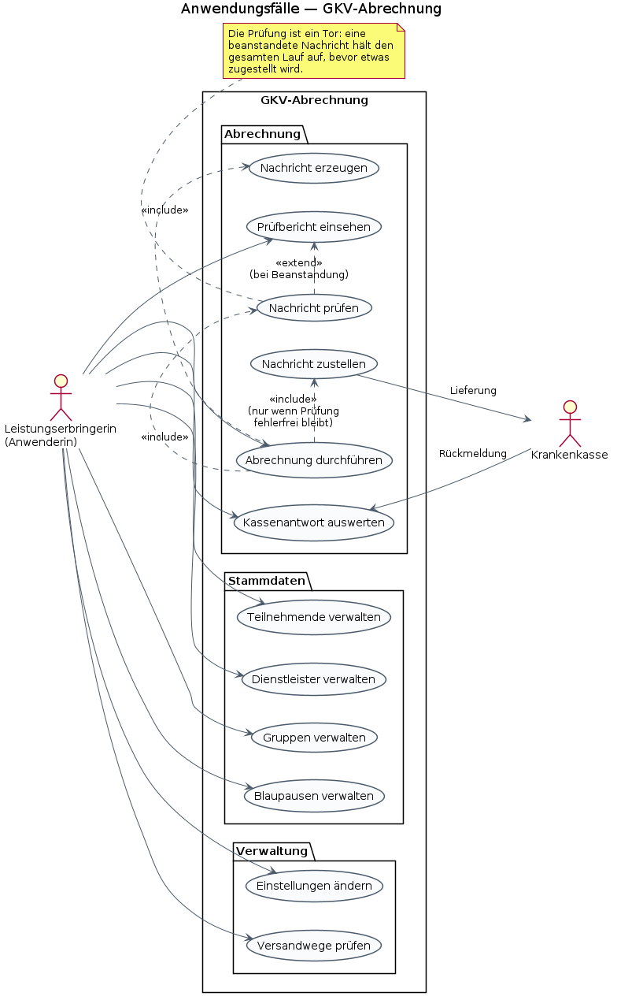
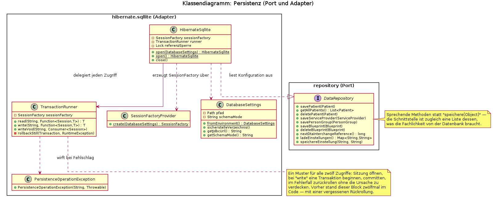
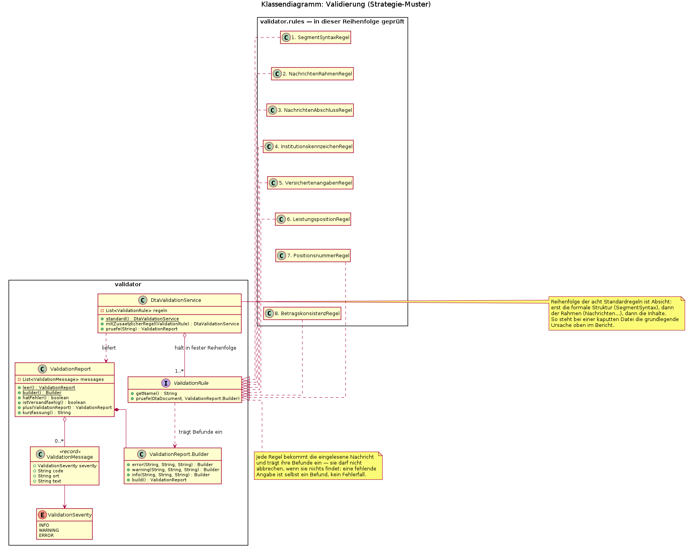
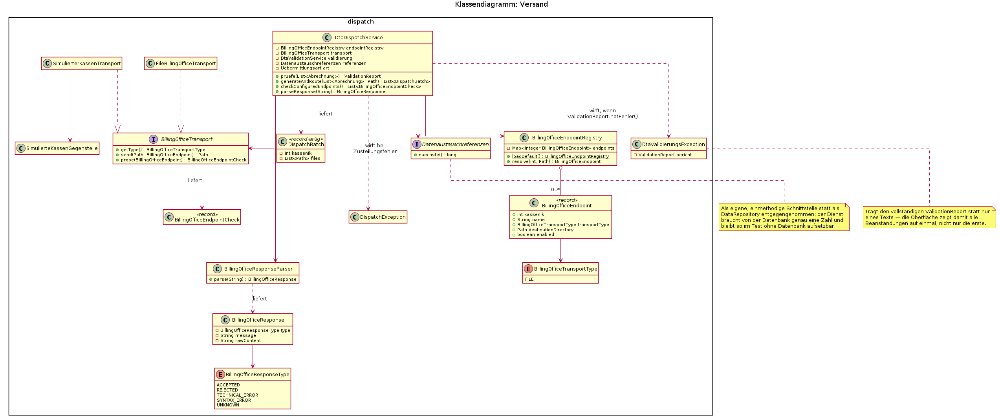
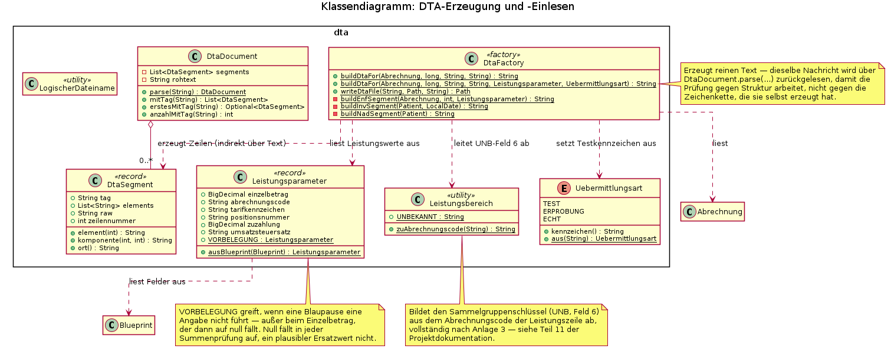
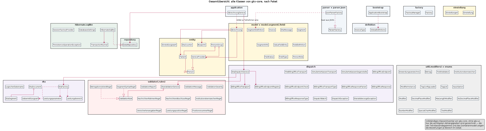
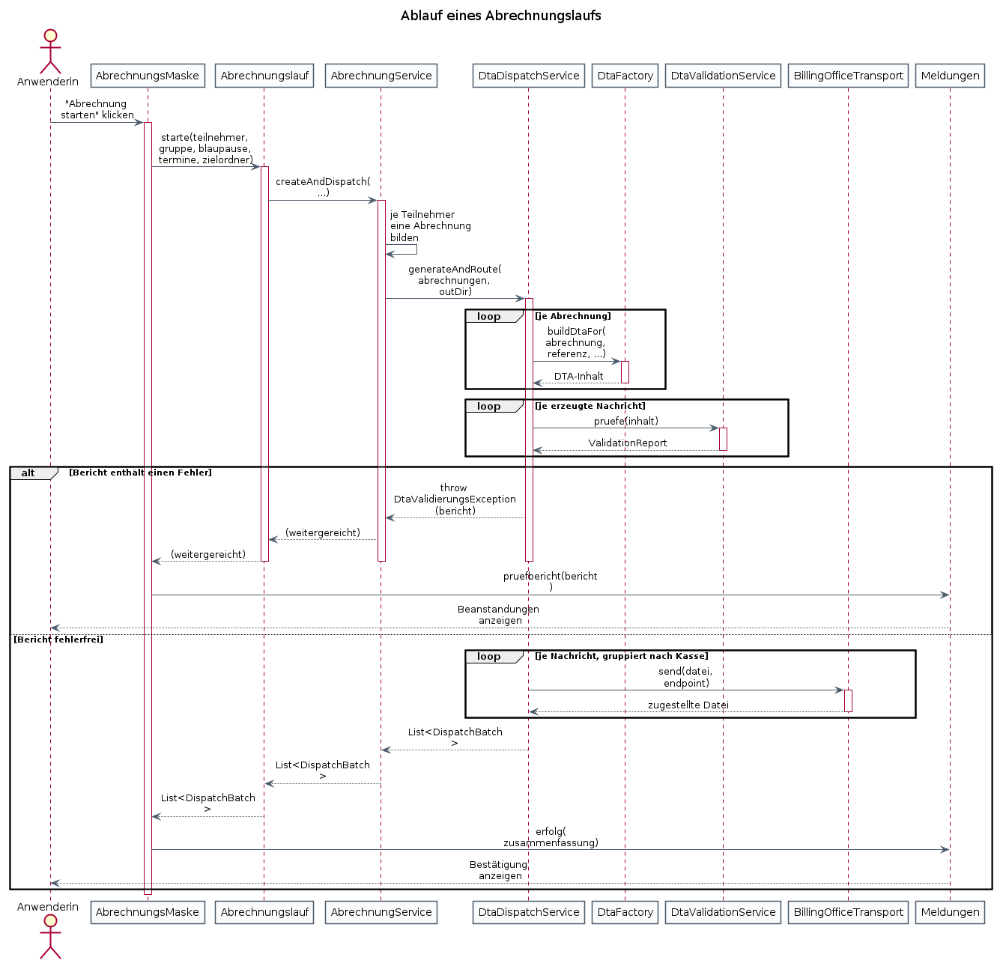
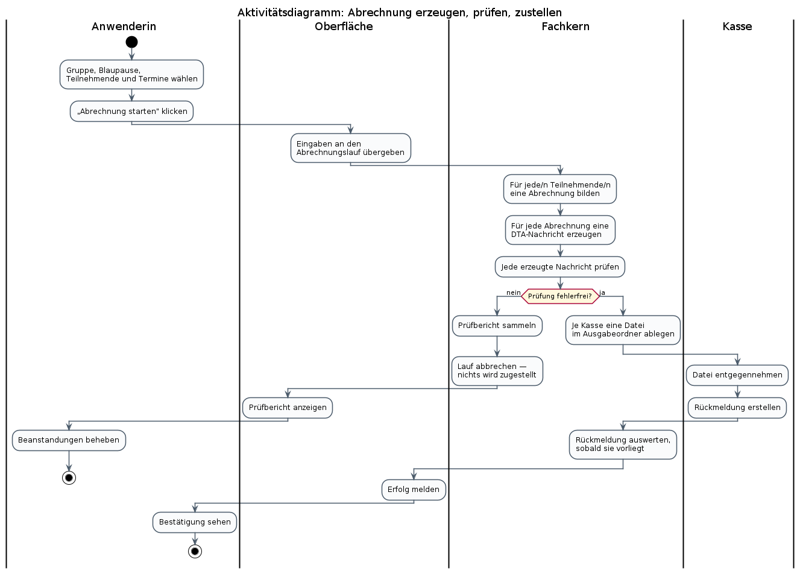
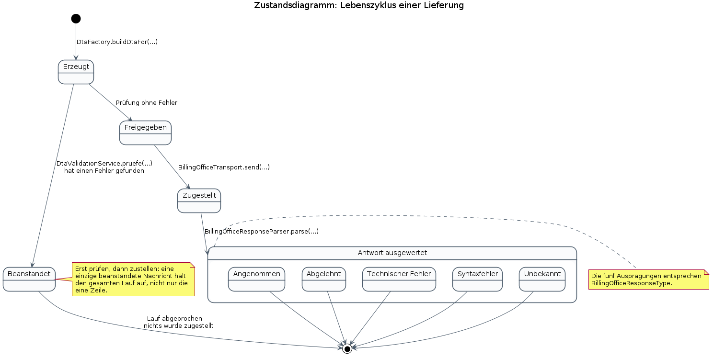

# Wozu dieses Dokument

Die Projektdokumentation unter `dokumentation/` erzählt den Weg des Projekts
in 23 Teilen — Entscheidungen, Alternativen, Sackgassen. Dieses Dokument
erzählt nichts. Es bündelt an einer Stelle, **wie das System aufgebaut ist und
wie es sich verhält** — als Nachschlagewerk in den üblichen UML-Sichten:
Anwendungsfälle, Struktur (Klassen, Datenbank, Komponenten) und Verhalten
(Sequenz, Aktivität, Zustand).

Nicht jede UML-Diagrammart passt auf jedes System. Aufgenommen ist nur, wofür
dieses Projekt einen echten Gegenstand hat:

| Diagrammart | Aufgenommen? | Warum |
|---|---|---|
| Anwendungsfälle | ja | Es gibt eine bediente Oberfläche mit klar abgegrenzten Funktionen |
| Klassendiagramm | ja, in sechs Ansichten | Fünf Teilbereiche mit eigener Verantwortung, dazu eine Gesamtübersicht |
| ER-Diagramm | ja | Die Daten liegen in einer eigenen SQLite-Datenbank |
| Komponentendiagramm | ja | Zwei Module mit einer erzwungenen Grenze — genau das zeigt diese Sicht |
| Sequenzdiagramm | ja | Der Abrechnungslauf ist ein Ablauf über mehrere Objekte hinweg, mit einer Prüfung als Tor davor |
| Aktivitätsdiagramm | ja | Derselbe Ablauf, aber mit Verantwortlichkeiten (wer tut was) statt Objektaufrufen |
| Zustandsdiagramm | ja | Eine Lieferung durchläuft echte, im Code benannte Zustände bis zur Rückmeldung der Kasse |

Beim Klassendiagramm reicht ein einzelnes Bild nicht: `gkv-core` umfasst rund
sechzig Klassen, Schnittstellen und Aufzählungen. Ein Diagramm mit allen
Attributen und Methoden aller sechzig Elemente wäre kein Diagramm mehr,
sondern eine Textwand mit Kästchen darum. Deshalb steht hier **eine
Gesamtübersicht** (Namen und die wichtigsten Abhängigkeiten, ohne Attribute)
neben **fünf Teil-Klassendiagrammen** — Domäne, Persistenz, Validierung,
Versand, DTA-Erzeugung —, die jeweils einen Verantwortungsbereich mit echten
Attributen, Methoden und Mustern zeigen. Wer wissen will, was eine Klasse
kann, schlägt im passenden Teildiagramm nach; wer wissen will, wo eine Klasse
liegt und womit sie zusammenhängt, schlägt in der Gesamtübersicht nach.

Sechs der zwölf Diagramme entstehen in der Projektdokumentation ohnehin
(Domäne, ER, Komponenten/Abhängigkeiten) und werden hier **wiederverwendet,
nicht neu gezeichnet** — dieselbe Quelle für zwei Dokumente vermeidet, dass
sie sich widersprechen. Neu für dieses Dokument sind die Anwendungsfälle, die
vier übrigen Teil-Klassendiagramme, die Gesamtübersicht sowie Sequenz-,
Aktivitäts- und Zustandsdiagramm — alle aus dem tatsächlichen Quelltext
abgeleitet, nicht aus dem Gedächtnis rekonstruiert.

Alle Diagramme liegen als PlantUML-Quelltext neben diesem Dokument unter
`Information/` und werden mit `plantuml -tpng <Datei>.puml` erzeugt — siehe
Tabelle am Ende dieses Dokuments.

# 1. Überblick: Module und Abhängigkeiten

Das Projekt besteht aus zwei Maven-Modulen mit einer erzwungenen Grenze:
`gkv-core` trägt die Fachlichkeit — Domäne, Persistenz, DTA-Erzeugung,
Validierung, Versand — und darf keine JavaFX-Abhängigkeit enthalten. Das ist
keine Vereinbarung, sondern durchgesetzt: Eine `maven-enforcer-plugin`-Regel
in `gkv-core/pom.xml` lässt den Bau fehlschlagen, sobald `org.openjfx` in den
Kern gelangt. `gkv-ui` enthält ausschließlich die Oberfläche und greift nur
über `gkv-core` auf die Fachlichkeit zu — nie umgekehrt.

Innerhalb von `gkv-core` gilt dieselbe Trennungsidee noch einmal, nur ohne
Werkzeugzwang: **Ports und Adapter.** `DataRepository` und
`BillingOfficeTransport` sind Schnittstellen (Ports), die die Fachlichkeit
kennt; `HibernateSqllite`, `FileBillingOfficeTransport` und
`SimulierterKassenTransport` sind Umsetzungen (Adapter) dazu, die die
Fachlichkeit nicht kennt. Der Vorteil zeigt sich im Test: `AbrechnungService`
und `DtaDispatchService` lassen sich mit einem Adapter aufsetzen, der nichts
auf Platte schreibt und keine Datenbank braucht.


# 2. Anwendungsfälle

Eine Anwenderin (Leistungserbringerin bzw. deren Abrechnungsstelle) pflegt
Stammdaten und stößt Abrechnungsläufe an; die Krankenkasse ist sekundärer
Akteur, der Lieferungen entgegennimmt und Rückmeldungen sendet. Beide Akteure
sind bewusst grob geschnitten — es gibt in diesem Projekt keine
Rollentrennung innerhalb der Anwenderschaft (etwa Sachbearbeitung gegen
Administration), also braucht es dafür keinen zweiten primären Akteur.



„Abrechnung durchführen" schließt „Nachricht erzeugen" und „Nachricht
prüfen" **immer** ein und „Nachricht zustellen" **nur dann**, wenn die
Prüfung fehlerfrei bleibt — das Prüfwerk ist als Tor vor dem Versand gebaut,
nicht als optionaler Zwischenschritt. Schlägt die Prüfung fehl, erweitert
„Prüfbericht einsehen" den Ablauf, statt dass zugestellt wird. Diese
Unterscheidung zwischen „include" (passiert immer) und „extend" (passiert nur
unter einer Bedingung) ist keine Formsache: Sie ist im Code dieselbe
Unterscheidung wie zwischen dem Regelfall in `generateAndRoute(...)` und dem
Ausnahmepfad über `DtaValidierungsException` — siehe Abschnitt 10.

# 3. Fachliches Modell — Domäne

Personen, Gruppen, Blaupausen und die Abrechnung, die sie verbindet — das
Domänenmodell, wie es in `gkv-core.entity` und `gkv-core.model` umgesetzt ist.


**`Person`** ist eine `@MappedSuperclass` ohne eigene Tabelle (siehe Abschnitt
9) und trägt die Felder, die eine Teilnehmerin und eine Dienstleisterin
gemeinsam haben: Name, Anschriftdaten, Institutionskennzeichen. **`Patient`**
und **`ServiceProvider`** erben davon und unterscheiden sich für das Modell
nur durch ihre Rolle, nicht durch eigene Felder. **`PersonGroup`** hält
Mitgliedschaft in beide Richtungen — Teilnehmende und Dienstleistende — und
ist bewusst die **einzige** Seite, die diese Beziehung kennt: Eine Person
weiß nicht, in welchen Gruppen sie steckt, das beantwortet nur eine Abfrage
über die Gruppe. Eine Beziehung mit einer verantwortlichen Seite kann nicht
in sich widersprüchlich werden.

**`Blueprint`** ist die Vorlage für eine Leistungszeile — Name, ein
Vorlagenname und ein `payload`-Textfeld, in dem die eigentlichen Werte als
JSON liegen (siehe `Leistungsparameter` in Abschnitt 7). **`DtaCounter`** hält
die laufende Nummer für die Datenaustauschreferenz im `UNB`, unter Schutz
gegen gleichzeitigen Zugriff (siehe Abschnitt 4). **`Einstellungswert`** ist
eine Schlüssel-Wert-Zeile für alles, was sich einstellen lässt — Dunkelmodus,
Übermittlungsart — statt einer eigenen Konfigurationsdatei neben der
Datenbank.

**`Abrechnung`** verbindet `Patient`, `ServiceProvider` und `Blueprint` mit
der Terminanzahl und dem Erzeugungszeitpunkt — sie ist die Vorlage, aus der
`DtaFactory` eine Nachricht baut (Abschnitt 7), und zugleich die einzige Spur,
die ein Abrechnungslauf in der Datenbank hinterlässt. Die Lieferung selbst
(die tatsächlich erzeugte und versendete Datei) hinterlässt keine.

Die Pakete `model.segment` und `model.segment.field` beschreiben nicht die
Fachlichkeit, sondern das **Nachrichtenformat** selbst als Daten:
`SegmentDefinition` und `FieldDefinition` legen Position, Typ, Länge und
Pflichtstatus eines Feldes fest, geladen aus JSON unter
`resources/segments/`. Dieselbe Beschreibung bedient drei Abnehmer —
Erzeugung, Prüfung und die Erklärtexte der Oberfläche — und verhindert damit,
dass sich drei Abschriften derselben Regel widersprechen.

# 4. Persistenz

Der Zugang zur Datenbank hinter einer Schnittstelle: `DataRepository` ist der
Port, `HibernateSqllite` der Adapter darauf.



`DataRepository` hat **sprechende Methoden** — `savePatient`,
`nextDtaInterchangeReference`, `speichereEinstellung` — statt einer
allgemeinen `speichere(Object)`. Das kostet mehr Methoden, gewinnt aber
Lesbarkeit: Die Schnittstelle ist zugleich eine vollständige Liste dessen,
was die Fachlichkeit von der Datenbank überhaupt braucht, und sie wächst nur,
wenn ein neuer Bedarf entsteht.

Jeder der zwölf Zugriffe in `HibernateSqllite` folgt demselben Muster —
Sitzung öffnen, bei einer schreibenden Arbeit eine Transaktion beginnen,
committen, im Fehlerfall zurückrollen. **`TransactionRunner`** trägt diesen
Rahmen an einer einzigen Stelle: `read(...)` für lesende, `write(...)` und
`writeVoid(...)` für schreibende Zugriffe, jeweils mit einer Beschreibung, die
im Fehlerfall in einer eigenen `PersistenceOperationException` landet — „ein
Fehler beim Rollback verdeckt nicht mehr die eigentliche Ursache", weil ein
fehlgeschlagener Rollback der ursprünglichen Ausnahme als `suppressed`
beigelegt wird, statt sie zu ersetzen.

`SessionFactoryProvider` baut die Hibernate-`SessionFactory` aus
`DatabaseSettings` auf — Datenbankpfad und Schema-Modus sind von außen
einstellbar (Systemeigenschaft oder Umgebungsvariable), damit Produktivbetrieb
und Tests getrennte Datenbanken benutzen. Der Modus, der das Schema neu
anlegt (`create`, `create-drop`), ist **nie voreingestellt** — er würde jeden
Bestand verwerfen.

# 5. Validierung

Acht austauschbare Prüfregeln hinter einer gemeinsamen Schnittstelle — das
Strategie-Muster als Tor vor dem Versand.



`ValidationRule` schreibt eine einzige Methode vor: `pruefe(document,
bericht)`. Eine Regel darf dabei **nicht abbrechen**, wenn sie etwas nicht
findet — eine fehlende Angabe ist selbst ein Befund, den sie in den
`ValidationReport.Builder` einträgt, keine Ausnahme, die die Prüfung beendet.
`DtaValidationService.standard()` reiht acht Regeln in einer bewusst
gewählten Reihenfolge: erst die formale Struktur (`SegmentSyntaxRegel`), dann
der Rahmen der Übertragung und der einzelnen Nachrichten
(`NachrichtenRahmenRegel`, `NachrichtenAbschlussRegel`), dann die Inhalte
(Institutionskennzeichen, Versichertenangaben, Leistungsposition,
Positionsnummer, Betragskonsistenz). So steht bei einer kaputten Datei die
grundlegende Ursache oben im Bericht, nicht eine Folgemeldung.

`ValidationReport` sammelt **alle** Befunde einer Prüfung statt beim ersten
Fehler abzubrechen — wer eine Abrechnung korrigiert, soll alle Beanstandungen
auf einmal sehen. Jeder `ValidationMessage`-Eintrag trägt neben dem Text
einen stabilen `code` (etwa `UNZ_ANZAHL`), getrennt von der Beschreibung,
damit sich Befunde auswerten lassen, ohne Meldungstexte zu vergleichen. Die
Gewichtung `ValidationSeverity` entscheidet, was zählt: Nur `ERROR` hält den
Versand auf, `WARNING` weist auf etwas hin, ohne ihn zu blockieren.

# 6. Versand

Nachrichten erzeugen, prüfen und an die richtige Kasse zustellen — inklusive
der Auswertung, was die Kasse zurückmeldet.



`DtaDispatchService` ist die zentrale Stelle: `generateAndRoute(...)` erzeugt
für jede Abrechnung eine Nachricht, prüft **alle** erzeugten Nachrichten und
liefert erst dann aus, wenn keine davon einen Fehler trägt — sonst wirft er
`DtaValidierungsException` mit dem vollständigen Bericht. Für die
Datenaustauschreferenz hängt der Dienst nicht am ganzen `DataRepository`,
sondern an der einmethodigen Schnittstelle `Datenaustauschreferenzen` mit
genau einer Methode, `naechste()` — dieselbe Überlegung wie bei
`Abrechnungslauf` in der Oberfläche: Ein Dienst, der nur eine Zahl braucht,
soll sich auch nur auf eine Zahl verlassen und bleibt so ohne Datenbank
testbar.

**`BillingOfficeTransport`** ist der Port zur Zustellung, mit zwei Adaptern:
`FileBillingOfficeTransport` legt die Datei in ein Verzeichnis,
`SimulierterKassenTransport` spielt zusätzlich eine `SimulierteKassenGegenstelle`
durch, die wie eine echte Kasse antwortet — nützlich, um den ganzen Ablauf
ohne echten Empfänger zu erproben. `BillingOfficeEndpointRegistry` löst eine
Kassen-IK auf ein `BillingOfficeEndpoint` auf, geladen aus
`billing-office-endpoints.json`.

**`BillingOfficeResponseParser`** ordnet eine Rückmeldung einer der fünf
`BillingOfficeResponseType`-Ausprägungen zu — `ACCEPTED`, `REJECTED`,
`TECHNICAL_ERROR`, `SYNTAX_ERROR`, `UNKNOWN`. Die Regeln dafür sind
**absichtlich in fester Reihenfolge von der spezifischsten zur allgemeinsten**
geprüft, mit an Wortgrenzen gebundenen Suchmustern: Die vorherige Fassung
prüfte `"fehler"` vor `"technisch"`, sodass „Technischer Fehler" als fachliche
Ablehnung durchging, und suchte nach Teilzeichenketten, sodass `"ok"` in
„Fehlerprotokoll" eine Annahme vortäuschte. Beide Fehler wirkten in dieselbe
Richtung — eine abgelehnte Lieferung konnte als angenommen gelten.

# 7. DTA-Erzeugung und -Einlesen

Aus einer `Abrechnung` wird eine Textdatei, und dieselbe Textdatei lässt sich
wieder in eine Struktur zurücklesen.



**`DtaFactory`** ist eine reine Fabrikklasse ohne Zustand: `buildDtaFor(...)`
liest Patient, Dienstleister und Leistungswerte und baut daraus die
Segmentzeilen als Text. **`DtaDocument.parse(...)`** liest genau diesen Text
wieder ein, in eine Liste von `DtaSegment`-Einträgen — der Umweg über das
Wiedereinlesen ist Absicht: Die Validierung (Abschnitt 5) prüft damit
**genau das Ergebnis, das die Kasse erhält**, unabhängig davon, wie es
entstanden ist, und kann auf demselben Weg auch eine Datei aus fremder Quelle
prüfen.

**`Leistungsparameter`** trägt die abrechnungsrelevanten Werte einer
Leistungszeile, gelesen aus dem `payload` einer `Blueprint`. Fehlt eine
Angabe, greift `VORBELEGUNG` — **außer beim Einzelbetrag**, der dann auf null
fällt statt auf einen plausiblen Ersatzwert. Der Grund ist eine reale
Sackgasse: Eine frühere Vorbelegung auf einen plausiblen Betrag lief
unbemerkt durch jede Prüfung, weil Menge, Einzelbetrag und Summen
untereinander konsistent blieben — nur eben mit einem erfundenen Wert. Null
fällt in jeder Summenprüfung auf, ein plausibler Ersatzwert nicht.

**`Leistungsbereich`** bildet den Sammelgruppenschlüssel im `UNB` (Feld 6)
aus dem Abrechnungscode der Leistungszeile ab, vollständig nach Anlage 3 —
mit `UNBEKANNT` als Rückgabe für einen nicht zuordenbaren Code, statt eines
erfundenen Buchstabens. **`Uebermittlungsart`** trägt Test-, Erprobungs- und
Echtkennzeichen; nicht zuordenbare Werte fallen auf `ERPROBUNG` zurück, nie
auf `ECHT` — ein Vertipper in einer Einstellung darf höchstens einen
zusätzlichen Versand kosten, nie eine ungewollte Forderung an eine Kasse.

# 8. Gesamtübersicht: alle Klassen

Die fünf vorigen Abschnitte zeigen Beziehungen im Detail, aber jeweils nur
für einen Bereich. Diese Übersicht zeigt das **vollständige Klasseninventar**
von `gkv-core` — ohne `gkv-ui`, dessen rund fünfzehn Oberflächenklassen bereits
im Komponentendiagramm (Abschnitt 1) als ein Paket erscheinen und für sich
keine eigene fachliche Struktur tragen.

```{=latex}
\begin{landscape}
```

{width=24cm}

```{=latex}
\end{landscape}
```

Gezeichnet sind nur die wichtigsten paketübergreifenden Abhängigkeiten — mit
allen tatsächlich vorhandenen wäre das Bild ein unlesbares Geflecht aus
sechzig Kästen. Wer eine konkrete Beziehung sucht, findet sie in einem der
fünf Teildiagramme oder im Quelltext; diese Übersicht beantwortet nur „gibt es
diese Klasse, und in welchem Paket liegt sie". Auch dafür lohnt sich das
Bild: Es zeigt zum Beispiel, dass `util.modifiers` allein sechs fast
gleichartige Klassen für Feldbeschränkungen trägt (Dezimalstellen, Höchstlänge,
Sonderzeichen …) — eine Beobachtung, die in keinem der Teildiagramme
auftaucht, weil keines davon dieses Paket im Mittelpunkt hat.

# 9. Datenhaltung — ER-Diagramm

Aus dem tatsächlichen SQLite-Schema ausgelesen, nicht aus den Klassen
abgeleitet — deshalb zeigt es auch, was den Klassen nicht anzusehen ist: das
Schema kommt ohne Fremdschlüssel aus, und `Person` als gemeinsame Oberklasse
(Abschnitt 3) hat keine eigene Tabelle, sondern dupliziert ihre Felder in den
Tabellen für `Patient` und `ServiceProvider`. Die Zuordnung von Personen zu
Gruppen liegt in eigenen Verbindungstabellen (`person_group_patient`,
`person_group_service_provider`), weil `PersonGroup` beide Richtungen einer
Vielfachbeziehung hält (Abschnitt 3).


# 10. Ablauf eines Abrechnungslaufs — Sequenzdiagramm

Vom Klick auf „Abrechnung starten" bis zur Bestätigung oder dem
Prüfbericht. Der zentrale Punkt: **erst werden alle Nachrichten erzeugt und
geprüft, und nur wenn keine davon beanstandet wird, geht überhaupt eine
hinaus.**



Die Oberfläche kennt dabei nur die Schnittstelle `Abrechnungslauf` mit ihrer
einen Methode `starte(...)` — nicht `AbrechnungService` selbst. Der Grund
ist derselbe wie bei `Datenaustauschreferenzen` in Abschnitt 6:
`AbrechnungService` ist `final` und baut in seinem Standardkonstruktor die
gesamte Versandkette samt Datenbankverbindung auf; im Test ließe er sich
weder ersetzen noch gefahrlos aufrufen. Die Oberfläche übergibt schlicht
`abrechnungService::createAndDispatch` als Methodenreferenz, ein Test eine
Lambda, die nichts weiter tut, als das Beispiel im Diagramm nachzuvollziehen.

# 11. Ablauf eines Abrechnungslaufs — Aktivitätsdiagramm

Derselbe Ablauf wie in Abschnitt 10, hier nach **Verantwortlichkeit**
geschnitten statt nach Objekt — hilfreich, um zu sehen, was bei Anwenderin,
Oberfläche, Fachkern und Kasse jeweils passiert, ohne die Aufrufreihenfolge
im Detail mitzuführen. Die Verzweigung „Prüfung fehlerfrei?" ist in beiden
Diagrammen dieselbe Stelle im Code: `ValidationReport.hatFehler()` in
`DtaDispatchService.generateAndRoute(...)`.



# 12. Lebenszyklus einer Lieferung — Zustandsdiagramm

Was aus einer erzeugten Nachricht wird, bis eine Kasse geantwortet hat. Die
fünf Endzustände nach der Zustellung entsprechen unmittelbar den fünf Werten
von `BillingOfficeResponseType` im Code (Abschnitt 6) — dieses Diagramm
bildet keine eigene Einteilung, sondern die, die bereits im Programm steht.
Der Zustand „Beanstandet" hat bewusst **keinen** Übergang nach „Zugestellt":
Genau das ist die Prüfung als Tor, die in den Abschnitten 5, 10 und 11 aus
drei verschiedenen Blickwinkeln auftaucht.



# Woher die Diagramme stammen

| Diagramm | Herkunft |
|---|---|
| Module und Abhängigkeiten | wiederverwendet aus der Projektdokumentation (Teil 05) |
| Anwendungsfälle | neu für dieses Dokument |
| Klassendiagramm der Domäne | wiederverwendet aus der Projektdokumentation (Teil 06) |
| Klassendiagramm der Persistenz | neu für dieses Dokument |
| Klassendiagramm der Validierung | neu für dieses Dokument |
| Klassendiagramm des Versands | neu für dieses Dokument |
| Klassendiagramm der DTA-Erzeugung | neu für dieses Dokument |
| Gesamtübersicht aller Klassen | neu für dieses Dokument |
| ER-Diagramm | wiederverwendet aus der Projektdokumentation (Teil 07) |
| Sequenzdiagramm | neu für dieses Dokument |
| Aktivitätsdiagramm | neu für dieses Dokument |
| Zustandsdiagramm | neu für dieses Dokument |

Die zugehörigen Quelldateien:

- Module und Abhängigkeiten — `05_Abhaengigkeiten.puml`
- Anwendungsfälle — `D01_UseCase.puml`
- Klassendiagramm der Domäne — `01_Domaene.puml`
- Klassendiagramm der Persistenz — `D05_Klassen_Persistenz.puml`
- Klassendiagramm der Validierung — `D06_Klassen_Validierung.puml`
- Klassendiagramm des Versands — `D07_Klassen_Versand.puml`
- Klassendiagramm der DTA-Erzeugung — `D08_Klassen_DtaErzeugung.puml`
- Gesamtübersicht aller Klassen — `D09_Klassen_Gesamtuebersicht.puml`
- ER-Diagramm — `04_Datenbank_ER.puml`
- Sequenzdiagramm — `D02_Sequenz_Abrechnungslauf.puml`
- Aktivitätsdiagramm — `D03_Aktivitaet_Abrechnungslauf.puml`
- Zustandsdiagramm — `D04_Zustand_Lieferung.puml`

Alle liegen unter `Information/` und werden einzeln erzeugt:

```bash
cd Information
plantuml -tpng D01_UseCase.puml
```

Ein Diagramm, das man von Hand malt, veraltet — deshalb ist der
PlantUML-Quelltext die Wahrheit, nicht das PNG daneben.

# Verhältnis zur Projektdokumentation

Dieses Dokument ersetzt die 23-teilige Projektdokumentation unter
`dokumentation/` nicht und wiederholt sie nicht. Dort steht, **warum** das
System so aufgebaut ist, mit den Alternativen, die verworfen wurden, und den
Sackgassen, die dazu geführt haben — hier steht nur, **wie** es aufgebaut
ist und sich verhält, für den schnellen Überblick oder als Einstieg vor dem
Lesen des Codes.
