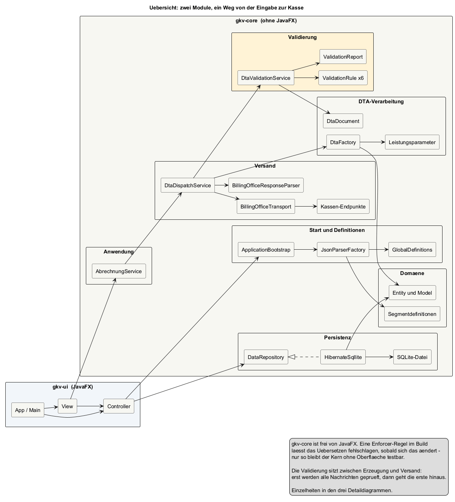
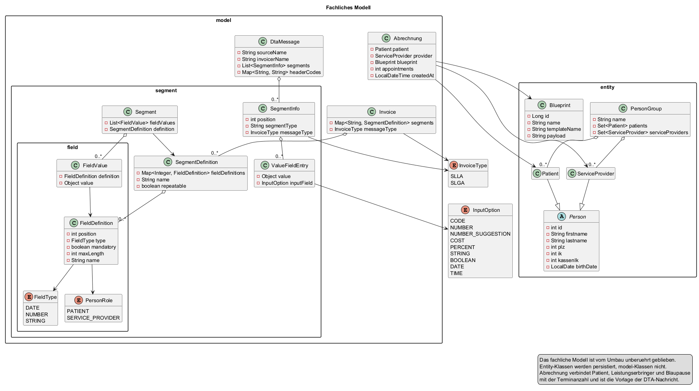
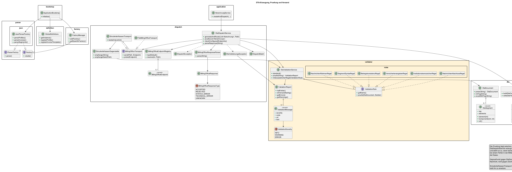
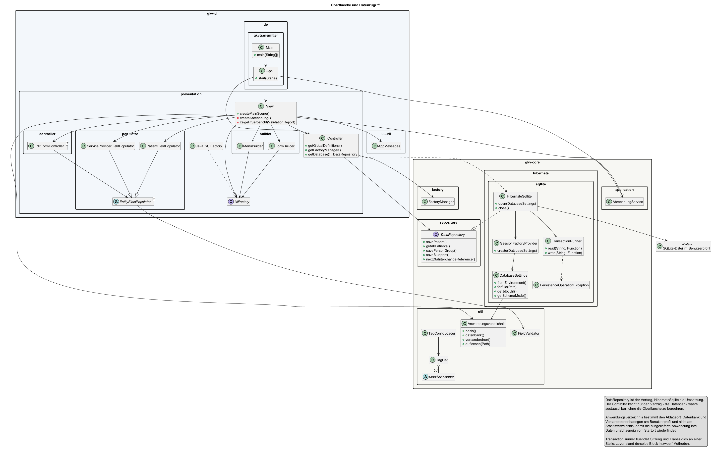

# Vision des GKVTransmitters

## Was soll das Programm können?

Der GKVTransmitter soll den digitalen Abrechnungsprozess medizinischer Leistungen mit gesetzlichen Krankenkassen unterstützen. Er soll Daten strukturiert erfassen, prüfen, in das vorgeschriebene DTA-Format umwandeln und an die passende Krankenkasse übergeben.

Die wichtigsten Funktionen sind:

- Patientinnen und Patienten sowie Leistungserbringer anlegen, bearbeiten, suchen und löschen
- Personen in Gruppen organisieren
- Abrechnungs-Blueprints speichern und wiederverwenden
- Abrechnungen aus Patient, Leistungserbringer, Blueprint und Terminanzahl erstellen
- DTA-Profile, Segmentdefinitionen und Rechnungsvorlagen aus JSON-Dateien laden
- Die Nachrichtentypen `SLLA` und `SLGA` sowie ihre Felder und Regeln berücksichtigen
- Pflichtfelder, Feldtypen, Feldlängen und Eingabeformate validieren
- Aus einer Abrechnung eine gültige DTA-Nachricht erzeugen
- Die erzeugten Dateien anhand der Krankenkassen-IK gruppieren und in konfigurierte Zielordner schreiben
- Ziel-Endpunkte prüfen und Versandantworten als angenommen, abgelehnt, technisch fehlerhaft oder unbekannt einordnen
- Die erzeugte DTA-Nachricht vor dem Versand gegen ein Regelwerk prüfen und den Versand bei Verstößen anhalten
- Den Ablauf bis zur Rückmeldung gegen eine simulierte Kasse durchspielen können, ohne echte Zugangsdaten
- Daten dauerhaft in einer SQLite-Datenbank speichern
- Den gesamten Ablauf über eine JavaFX-Oberfläche bedienbar machen

Das Programm soll dadurch manuelle Übertragungsfehler reduzieren, wiederkehrende Abrechnungen vereinfachen und eine nachvollziehbare Verarbeitung von der Eingabe bis zur fertigen DTA-Datei ermöglichen.

## Wie soll das Programm betrieben werden?

Als eigenständige Anwendung auf einem einzelnen Rechner. Es gibt **keinen Server**, keinen Datenbankdienst und keine Installationsvoraussetzung — auch kein installiertes Java. Die ausgelieferte Fassung bringt ihre eigene Java-Laufzeit mit; der Ordner wird kopiert und das Programm per Doppelklick gestartet.

Eine Internetverbindung wird ausschließlich für den Versand an die Krankenkassen benötigt. Alles Übrige — Stammdatenpflege, Abrechnungserstellung, DTA-Erzeugung und Prüfung — funktioniert ohne Netz.

Die Daten liegen im Benutzerprofil (unter Windows `%LOCALAPPDATA%\GKVTransmitter`) und damit unabhängig davon, von wo die Anwendung gestartet wurde. Eine Sicherung des Ordners genügt, um Datenbank, Blaupausen und erzeugte DTA-Dateien zu sichern.

## Welcher Architektur folgt das Programm?

Das Programm folgt im Kern einer **mehrschichtigen Architektur**. Die Verantwortlichkeiten sind nach Benutzeroberfläche, Anwendungssteuerung, Fachmodell, Verarbeitung und Persistenz getrennt.

### Zwei Module

Die Trennung ist nicht nur eine Paketkonvention, sondern im Build verankert. Das Projekt besteht aus zwei Maven-Modulen:

| Modul | Inhalt |
|---|---|
| `gkv-core` | Domäne, DTA-Erzeugung, Validierung, Versand, Persistenz — **ohne JavaFX** |
| `gkv-ui` | ausschließlich die JavaFX-Oberfläche |

Eine Enforcer-Regel in `gkv-core` lässt den Bau fehlschlagen, sobald eine JavaFX-Abhängigkeit in den Kern gelangt. Das ist beabsichtigt: nur ein oberflächenfreier Kern lässt sich ohne laufende Anwendung testen, und daran hängt die automatisierte Prüfung der Fachlogik. Ohne diese Schranke wandert Fachlogik erfahrungsgemäß nach und nach in die Oberfläche zurück.

### Anschlüsse und Umsetzungen

An drei Stellen ist bewusst ein Vertrag von seiner Umsetzung getrennt, damit sich das Programm erweitern lässt, ohne Bestehendes anzufassen:

| Vertrag | Heutige Umsetzung | Erweiterbar um |
|---|---|---|
| `DataRepository` | `HibernateSqllite` | eine andere Datenhaltung |
| `BillingOfficeTransport` | `FileBillingOfficeTransport`, `SimulierterKassenTransport` | einen echten Übermittlungsweg |
| `ValidationRule` | sechs mitgelieferte Regeln | weitere fachliche Prüfungen |

### UML-Struktur

Das Klassendiagramm `Information/Projektklassen.puml` beschreibt die statische Struktur des Programms:

- **Pakete:** Die `package`-Blöcke ordnen die Klassen nach Verantwortlichkeit und Java-Paket zu, zum Beispiel `presentation`, `model`, `parser`, `dta`, `dispatch` und `hibernate.sqllite`.
- **Klassen:** Die `class`-Elemente zeigen konkrete Objekte und Services, zum Beispiel `Patient`, `Abrechnung`, `DtaFactory` und `DtaDispatchService`.
- **Interfaces:** `ParserFactory`, `Factory`, `UiFactory`, `BillingOfficeTransport` und `ValidationRule` beschreiben austauschbare Schnittstellen.
- **Abstrakte Klassen:** `EntityFieldPopulator` und `ModifierInstance` stellen gemeinsame Oberstrukturen für spezialisierte Klassen bereit.
- **Enumerationen:** `InvoiceType`, `FieldType`, `InputOption`, `Modifier` und die Versand-Enumerationen begrenzen erlaubte Werte.
- **Vererbung und Implementierung:** `Patient` und `ServiceProvider` erben von `Person`. `JsonParserFactory`, `JavaFxUiFactory` und `FileBillingOfficeTransport` implementieren Interfaces. Im Diagramm wird das durch `--|>` dargestellt.
- **Aggregation bzw. Komposition:** Klassen enthalten andere Objekte, zum Beispiel `PersonGroup` mehrere Patienten und Leistungserbringer oder `SegmentDefinition` mehrere `FieldDefinition`-Objekte. Diese Beziehungen sind im Diagramm mit `o--` dargestellt.
- **Abhängigkeiten:** Pfeile wie `View --> Controller` oder `DtaDispatchService --> DtaFactory` zeigen, welche Klassen andere Klassen verwenden.

### Verwendete bzw. erkennbare Patterns

Die Patterns und ihre Fundstellen im Programm und in dieser Dokumentation sind:

| Pattern bzw. Architekturansatz | Umsetzung im Programm | Fundstelle im UML-Diagramm / in dieser Dokumentation |
|---|---|---|
| MVC-nahe Struktur | `App` startet die Anwendung, `View` bildet die Oberfläche ab, `Controller` vermittelt und initialisiert | Pakete `presentation` und `application`, Abschnitt „UML-Struktur“ und dieser Abschnitt |
| Bootstrap Pattern | `ApplicationBootstrap.initialize()` lädt Profile und Vorlagen beim Start | Paket `de.gkvtransmitter.bootstrap`, Abschnitt „Grober Ablauf“ |
| Singleton | `GlobalDefinitions.getInstance()` liefert eine zentrale Registry | Klasse `GlobalDefinitions` im Paket `definition` |
| Registry Pattern | `GlobalDefinitions`, `FactoryManager` und `BillingOfficeEndpointRegistry` verwalten Profile, Fabriken bzw. Versandziele | Klassen in `definition`, `factory` und `dispatch` |
| Factory Pattern | `JsonParserFactory` erzeugt aus JSON die fachlichen Definitionen; `Factory` beschreibt die Erzeugungsschnittstelle | `JsonParserFactory ..|> Factory` und Paket `parser.json` |
| Abstract-Factory-ähnlicher Ansatz | `UiFactory` kapselt die Erzeugung verschiedener JavaFX-Komponenten; `JavaFxUiFactory` implementiert sie | `JavaFxUiFactory ..|> UiFactory` und Paket `presentation` (Modul `gkv-ui`) |
| Builder Pattern | `FormBuilder` und `MenuBuilder` erstellen UI-Strukturen schrittweise | Paket `presentation.builder` |
| Strategy-/Adapter-Ansatz | `BillingOfficeTransport` definiert den Versandvertrag; `FileBillingOfficeTransport` stellt Dateien zu | `FileBillingOfficeTransport ..|> BillingOfficeTransport` und Paket `dispatch` |
| Decorator | `SimulierterKassenTransport` umschließt einen beliebigen Transport und ergänzt eine Rückmeldung, statt ihn zu ersetzen | Paket `dispatch`, UML-Ansicht „DTA und Versand“ |
| Chain of Responsibility / Regelwerk | `DtaValidationService` führt austauschbare `ValidationRule`-Umsetzungen über dieselbe Nachricht | Pakete `validator` und `validator.rules` |
| Domain Model | Fachliche Objekte werden durch `Patient`, `ServiceProvider`, `Abrechnung`, `Invoice`, `SegmentDefinition` und weitere Modellklassen beschrieben | Pakete `entity`, `model` und `model.segment` |
| Repository plus Data Mapper / ORM | `DataRepository` definiert den Persistenzvertrag; `HibernateSqllite` implementiert ihn und bildet Entity-Klassen auf SQLite ab | Pakete `repository` und `hibernate.sqllite`, UML-Ansicht „Präsentation und Persistenz“ |

Nicht jede Struktur im Diagramm ist ein Design Pattern. Klassen wie `Patient` oder `Abrechnung` sind vor allem Bestandteile des Domain Models; Vererbung, Interfaces, Aggregationen und Abhängigkeiten sind UML-Modellierungsmittel.

### Grober Ablauf

1. `App` startet JavaFX und erzeugt den `Controller`.
2. Der `Controller` startet `ApplicationBootstrap` und öffnet die Datenbank über `HibernateSqllite.open()`.
3. `JsonParserFactory` liest JSON-Profile, Segmentdefinitionen und Vorlagen.
4. `GlobalDefinitions` hält die geladenen Definitionen zur Laufzeit vor.
5. `View` erfasst Abrechnungsdaten und übergibt sie an `AbrechnungService`.
6. `AbrechnungService` erstellt die `Abrechnung`-Objekte und ruft `DtaDispatchService` auf.
7. `DtaDispatchService` erzeugt über `DtaFactory` **alle** Nachrichten des Laufs. Die Leistungsangaben stammen dabei aus der gewählten Blaupause (`Leistungsparameter`).
8. `DtaValidationService` prüft jede erzeugte Nachricht. Dazu wird sie über `DtaDocument` wieder eingelesen und gegen die Regeln geprüft — geprüft wird also die Struktur der Nachricht, nicht der Weg ihrer Entstehung.
9. **Nur wenn keine Nachricht beanstandet wird, geht überhaupt eine hinaus.** Andernfalls bricht `DtaValidierungsException` den Lauf ab und die Oberfläche zeigt alle Beanstandungen auf einmal.
10. `BillingOfficeTransport` stellt die Dateien zu; das Ziel ergibt sich aus der Kassen-IK der versicherten Person.
11. `BillingOfficeResponseParser` ordnet die Rückmeldung der Kasse ein.
12. `HibernateSqllite` speichert bzw. lädt die verwalteten Stammdaten und Blaupausen.

Schritt 9 ist die wesentliche Entscheidung im Ablauf: Prüfung und Zustellung sind zwei getrennte Durchgänge. Würde je Abrechnung geprüft und sofort zugestellt, läge bei einem Fehler in der Mitte eines Laufs bereits ein Teil bei der Kasse und müsste dort einzeln storniert werden.

### Was die Prüfung leistet

| Regel | Prüft |
|---|---|
| `SegmentSyntaxRegel` | Abschlusszeichen, Bezeichnerform, bekannte Segmente |
| `NachrichtenRahmenRegel` | UNB/UNZ, Nachrichtenanzahl, Datenaustauschreferenz |
| `NachrichtenAbschlussRegel` | UNH/UNT, Segmentanzahl je Nachricht |
| `InstitutionskennzeichenRegel` | Länge und Prüfziffer der IK |
| `VersichertenangabenRegel` | Name, Geburtsdatum, Versichertennummer |
| `BetragskonsistenzRegel` | ENF gegen BES, BES gegen GES |

Nur Fehler halten den Versand auf, Warnungen nicht. Diese Abstufung ist bewusst: eine Warnung, die man nicht braucht, ist lästig — ein Fehler, den man nicht braucht, verhindert eine berechtigte Abrechnung.

`Information/Valide.DTA` dient als Messlatte. Die Datei gilt im Projekt als korrekte Lieferung und muss die Prüfung unbeanstandet durchlaufen.

### Was das Programm heute nicht leistet

Damit sich niemand darauf verlässt:

- Der Versand ist dateibasiert. Ein signierter und verschlüsselter Übermittlungsweg an reale Annahmestellen ist nicht umgesetzt; dafür wären Zertifikate einer anerkannten Stelle, Zugangsdaten und ein eigenes Betriebsstätten-IK nötig.
- Positionsnummern, Tarifkennzeichen und Abrechnungscodes werden auf Form, aber nicht auf fachliche Zulässigkeit geprüft.
- Es gibt keine Stornierung und keine Nachberechnung.
- Der Umsatzsteuersatz ist mit 19 fest hinterlegt.
- Abgedeckt ist der Leistungsbereich SGS H mit Abrechnungscode `61`.

### Einordnung des PlantUML-Diagramms

Die UML-Dokumentation ist in vier Ansichten aufgeteilt. `Information/Projektklassen.puml` ist die Paketübersicht; `01_Domaene.puml` zeigt das Domänenmodell, `02_DTA_und_Versand.puml` den Parsing-, Erzeugungs- und Versandablauf und `03_Praesentation_und_Persistenz.puml` die UI- und Datenbankseite. Die Vererbung, Factory-Implementierungen, Domänenbeziehungen sowie die wichtigsten Abhängigkeiten sind dadurch einzeln lesbar.

Das Diagramm ist damit inhaltlich passend zum aktuellen Programmstand. Es ist bewusst kein vollständiges Diagramm aller JavaFX- und Hibernate-Typen, damit die fachlich wichtigen Beziehungen lesbar bleiben.

## UML-Diagramme

### Paketübersicht

### Domänenmodell

### DTA und Versand

### Präsentation und Persistenz

