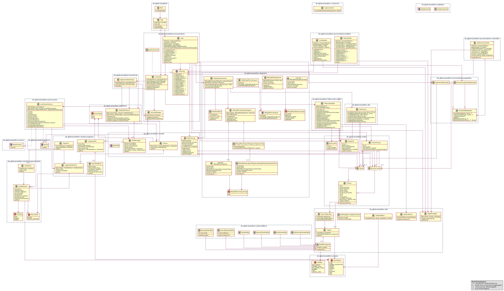

# Vision des GKVTransmitters

## Was soll das Programm können?

Der GKVTransmitter soll den digitalen Abrechnungsprozess medizinischer Leistungen mit gesetzlichen Krankenkassen unterstützen. Er soll Daten strukturiert erfassen, prüfen, in das vorgeschriebene DTA-Format umwandeln und an die passende Krankenkasse übergeben.

Die wichtigsten Funktionen sind:

- Patientinnen und Patienten sowie Leistungserbringer anlegen, bearbeiten, suchen und löschen
- Personen in Gruppen organisieren
- Abrechnungs-Blueprints speichern und wiederverwenden
- Abrechnungen aus Patient, Leistungserbringer, Blueprint und Terminanzahl erstellen
- DTA-Profile, Segmentdefinitionen und Rechnungsvorlagen aus JSON-Dateien laden
- Die Nachrichtentypen `SLLA` und `SLGA` sowie ihre Felder und Regeln berücksichtigen
- Pflichtfelder, Feldtypen, Feldlängen und Eingabeformate validieren
- Aus einer Abrechnung eine gültige DTA-Nachricht erzeugen
- Die erzeugten Dateien anhand der Krankenkassen-IK gruppieren und in konfigurierte Zielordner schreiben
- Ziel-Endpunkte prüfen und Versandantworten als angenommen, abgelehnt, technisch fehlerhaft oder unbekannt einordnen
- Daten dauerhaft in einer SQLite-Datenbank speichern
- Den gesamten Ablauf über eine JavaFX-Oberfläche bedienbar machen

Das Programm soll dadurch manuelle Übertragungsfehler reduzieren, wiederkehrende Abrechnungen vereinfachen und eine nachvollziehbare Verarbeitung von der Eingabe bis zur fertigen DTA-Datei ermöglichen.

## Welcher Architektur folgt das Programm?

Das Programm folgt im Kern einer **mehrschichtigen Architektur**. Die Verantwortlichkeiten sind nach Benutzeroberfläche, Anwendungssteuerung, Fachmodell, Verarbeitung und Persistenz getrennt.

### UML-Struktur

Das Klassendiagramm `Information/Projektklassen.puml` beschreibt die statische Struktur des Programms:

- **Pakete:** Die `package`-Blöcke ordnen die Klassen nach Verantwortlichkeit und Java-Paket zu, zum Beispiel `presentation`, `model`, `parser`, `dta`, `dispatch` und `hibernate.sqllite`.
- **Klassen:** Die `class`-Elemente zeigen konkrete Objekte und Services, zum Beispiel `Patient`, `Abrechnung`, `DtaFactory` und `DtaDispatchService`.
- **Interfaces:** `ParserFactory`, `Factory`, `UiFactory`, `BillingOfficeTransport` und `ValidationRule` beschreiben austauschbare Schnittstellen.
- **Abstrakte Klassen:** `EntityFieldPopulator` und `ModifierInstance` stellen gemeinsame Oberstrukturen für spezialisierte Klassen bereit.
- **Enumerationen:** `InvoiceType`, `FieldType`, `InputOption`, `Modifier` und die Versand-Enumerationen begrenzen erlaubte Werte.
- **Vererbung und Implementierung:** `Patient` und `ServiceProvider` erben von `Person`. `JsonParserFactory`, `JavaFxUiFactory` und `FileBillingOfficeTransport` implementieren Interfaces. Im Diagramm wird das durch `--|>` dargestellt.
- **Aggregation bzw. Komposition:** Klassen enthalten andere Objekte, zum Beispiel `PersonGroup` mehrere Patienten und Leistungserbringer oder `SegmentDefinition` mehrere `FieldDefinition`-Objekte. Diese Beziehungen sind im Diagramm mit `o--` dargestellt.
- **Abhängigkeiten:** Pfeile wie `View --> Controller` oder `DtaDispatchService --> DtaFactory` zeigen, welche Klassen andere Klassen verwenden.

### Verwendete bzw. erkennbare Patterns

Die Patterns und ihre Fundstellen im Programm und in dieser Dokumentation sind:

| Pattern bzw. Architekturansatz | Umsetzung im Programm | Fundstelle im UML-Diagramm / in dieser Dokumentation |
|---|---|---|
| MVC-nahe Struktur | `App` startet die Anwendung, `View` bildet die Oberfläche ab, `Controller` vermittelt und initialisiert | Paket `de.gkvtransmitter.presentation`, Abschnitt „UML-Struktur“ und dieser Abschnitt |
| Bootstrap Pattern | `ApplicationBootstrap.initialize()` lädt Profile und Vorlagen beim Start | Paket `de.gkvtransmitter.bootstrap`, Abschnitt „Grober Ablauf“ |
| Singleton | `GlobalDefinitions.getInstance()` liefert eine zentrale Registry | Klasse `GlobalDefinitions` im Paket `definition` |
| Registry Pattern | `GlobalDefinitions`, `FactoryManager` und `BillingOfficeEndpointRegistry` verwalten Profile, Fabriken bzw. Versandziele | Klassen in `definition`, `presentation` und `dispatch` |
| Factory Pattern | `JsonParserFactory` erzeugt aus JSON die fachlichen Definitionen; `Factory` beschreibt die Erzeugungsschnittstelle | `JsonParserFactory ..|> Factory` und Paket `parser.json` |
| Abstract-Factory-ähnlicher Ansatz | `UiFactory` kapselt die Erzeugung verschiedener JavaFX-Komponenten; `JavaFxUiFactory` implementiert sie | `JavaFxUiFactory ..|> UiFactory` und Paket `presentation` |
| Builder Pattern | `FormBuilder` und `MenuBuilder` erstellen UI-Strukturen schrittweise | Paket `presentation.builder` |
| Strategy-/Adapter-Ansatz | `BillingOfficeTransport` definiert den Versandvertrag, `FileBillingOfficeTransport` implementiert den Datei-Versand | `FileBillingOfficeTransport ..|> BillingOfficeTransport` und Paket `dispatch` |
| Domain Model | Fachliche Objekte werden durch `Patient`, `ServiceProvider`, `Abrechnung`, `Invoice`, `SegmentDefinition` und weitere Modellklassen beschrieben | Pakete `entity`, `model` und `model.segment` |
| Data Mapper / ORM | Hibernate bildet Entity-Klassen auf SQLite ab | Paket `hibernate.sqllite`, Klasse `HibernateSqllite` |

Nicht jede Struktur im Diagramm ist ein Design Pattern. Klassen wie `Patient` oder `Abrechnung` sind vor allem Bestandteile des Domain Models; Vererbung, Interfaces, Aggregationen und Abhängigkeiten sind UML-Modellierungsmittel.

### Grober Ablauf

1. `App` startet JavaFX und erzeugt den `Controller`.
2. Der `Controller` startet `ApplicationBootstrap`.
3. `JsonParserFactory` liest JSON-Profile, Segmentdefinitionen und Vorlagen.
4. `GlobalDefinitions` hält die geladenen Definitionen zur Laufzeit vor.
5. `View` erfasst Abrechnungsdaten und erstellt ein `Abrechnung`-Objekt.
6. `DtaDispatchService` verwendet `DtaFactory`, erzeugt die DTA-Datei und ermittelt das Ziel anhand der Kassen-IK.
7. `FileBillingOfficeTransport` legt die Datei im konfigurierten Ziel ab.
8. `HibernateSqllite` speichert bzw. lädt die verwalteten Stammdaten und Blueprints.

### Einordnung des PlantUML-Diagramms

`Information/Projektklassen.puml` stellt diese Architektur als Klassen- und Abhängigkeitsdiagramm dar. Die Vererbung, Factory-Implementierungen, Domänenbeziehungen sowie die Abhängigkeiten zwischen UI, Bootstrap, Parser, DTA-Erzeugung, Versand und Persistenz sind enthalten. Die direkten Abhängigkeiten des `View` zu `Blueprint`, `PersonGroup`, `Abrechnung` und `DtaDispatchService` sind ebenfalls eingetragen.

Das Diagramm ist damit inhaltlich passend zum aktuellen Programmstand. Es ist bewusst kein vollständiges Diagramm aller JavaFX- und Hibernate-Typen, damit die fachlich wichtigen Beziehungen lesbar bleiben.

## UML-Klassendiagramm

