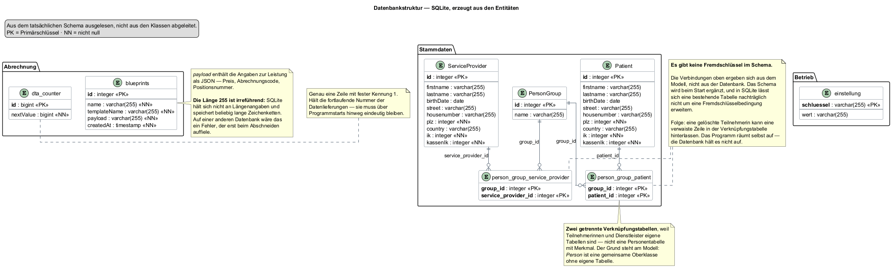

# Teil 01 — Vision

## Ausgangslage

Wer als Freiberuflerin Leistungen für gesetzlich Versicherte erbringt, rechnet
sie nicht mit den Versicherten ab, sondern **mit deren Krankenkasse**. Das gilt
für Hebammenhilfe ebenso wie für Heilmittel oder Rehabilitationssport — die
Leistungen unterscheiden sich, das Verfahren dahinter kaum.

Der konkrete Anlass dieses Projekts sind Kurse einer freiberuflich tätigen
Hebamme: Geburtsvorbereitung, Rückbildung, Beratung in Gruppen. Er ist der erste
Fall, nicht der einzige denkbare.

Abgerechnet wird nicht mit einer Rechnung. Die Kassen nehmen dafür weder Briefe
noch PDF-Dateien entgegen, sondern eine strukturierte Datenlieferung in einem
festgelegten Format — **bis auf das einzelne Zeichen vorgegeben.**

Für eine einzelne Leistungserbringerin gibt es dafür zwei Wege:

| Weg | Was er bedeutet | Was er kostet |
|---|---|---|
| **Über eine Abrechnungsstelle** | Ein Dienstleister übernimmt Erstellung, Übermittlung und das Nachhalten der Zahlungen | einen Anteil des abgerechneten Betrags, üblich sind wenige Prozent |
| **Selbst** | Ein eigenes Programm erzeugt die Datei | die Einarbeitung in das Verfahren |

Die Daten, aus denen eine Abrechnung besteht, liegen ohnehin vor: wer hat wann
welche Leistung erhalten, in welchem Umfang, bei welcher Kasse versichert.
**Sie liegen nur in Listen und Köpfen statt in einer Datei.**

## Vision — was das Programm am Ende können soll

Ein Satz vorweg, an dem sich alles Weitere messen lassen muss:

> **Eine einzelne Leistungserbringerin rechnet ihre Leistungen selbst mit den
> gesetzlichen Kassen ab — ohne Abrechnungsstelle, ohne Fachwissen über das
> Datenformat und ohne die Sorge, dass eine fehlerhafte Datei erst Wochen
> später auffällt.**

Ausformuliert heißt das: am Ende kann das Programm dies.

| # | Am Ende kann das Programm … | Woran man merkt, dass es stimmt |
|---|---|---|
| 1 | **Stammdaten führen** — versicherte Personen, die Leistungserbringerin, Leistungsfälle und was sie kosten | Ein neuer Kurs ist in wenigen Minuten erfasst, ohne Handbuch |
| 2 | **Aus einem Zeitraum eine Lieferung erzeugen** — je Empfänger eine, im vorgeschriebenen Format | Aus „März, diese drei Kurse" wird eine fertige Datei |
| 3 | **Vor dem Versand prüfen** und in verständlicher Sprache sagen, was fehlt | Der Bericht nennt die Stelle und was zu tun ist, nicht nur den Feldnamen |
| 4 | **Die Lieferung zustellen** — auf dem vorgeschriebenen Weg, an die zuständige Datenannahmestelle, verschlüsselt und signiert | Die Kasse nimmt sie an, ohne dass jemand nachfassen muss |
| 5 | **Die Antwort einordnen** — angenommen, fachlich zurückgewiesen, Syntaxfehler, technischer Fehler | Die Anwenderin weiß nach dem Lesen, ob sie korrigieren, neu erzeugen oder nur erneut senden muss |
| 6 | **Eine Zurückweisung nachbearbeiten**, ohne alles neu zu erfassen | Die korrigierte Abrechnung geht als neue Lieferung hinaus, mit sauberer Nummer |
| 7 | **Einen weiteren Leistungsbereich aufnehmen** — über Einträge, nicht über Umbau | Rehabilitationssport neben Hebammenhilfe, ohne dass eine Klasse sich ändert |
| 8 | **Sich rechnen** — über die Jahre weniger kosten als der Anteil, den eine Abrechnungsstelle nimmt | Die Summe aus Gebühren und Pflegeaufwand bleibt unter diesem Anteil |

Und das alles **auf einem einzelnen Rechner, ohne Installation und ohne dass
Gesundheitsdaten das Haus verlassen.**

### Der finanzielle Punkt

Punkt 8 ist kein Anhängsel, sondern die Bedingung, unter der das ganze Vorhaben
steht. Ein Programm, das funktioniert und trotzdem teurer ist als der Weg über
einen Dienstleister, hat sein Ziel verfehlt.

Die beiden Wege haben **unterschiedlich geformte Kosten** — das ist der Kern der
Sache:

| | Abrechnungsstelle | Selbst abrechnen |
|---|---|---|
| **Art der Kosten** | ein Anteil am abgerechneten Betrag | ein fester Betrag im Jahr |
| **Wächst mit** | dem Umsatz | nichts — der Betrag bleibt |
| **Läuft weiter** | solange abgerechnet wird | solange abgerechnet wird |
| **Zusätzlich** | — | die eigene Zeit für Pflege und Änderungen |

Daraus folgt eine einfache Regel: **Prozentkosten wachsen mit, Festkosten nicht.**
Unterhalb eines bestimmten Jahresumsatzes gewinnt der Dienstleister, oberhalb der
eigene Weg. Wo dieser Punkt liegt, hängt an Zahlen, die hier noch nicht alle
vorliegen.

Zwei davon sind bereits bekannt und gehören in die Rechnung:

| Posten | Was er kostet |
|---|---|
| Das Zertifikat für die Übermittlung | im ersten Jahr mehr als in den folgenden, **je Betriebsstätte und Jahr, nicht je Kasse** |
| Die Betriebsnummer für den Abrechnungsverkehr | gebührenfrei |
| Die laufende Pflege | keine Rechnung, aber Zeit — die Vorgaben ändern sich jährlich |

Der letzte Posten ist der, den man beim Rechnen vergisst. **Ein Programm, das
niemand pflegt, wird nicht billiger — es hört auf zu funktionieren**, weil ein
Schlüsselverzeichnis wechselt oder eine Formatfassung abgelöst wird. Deshalb
zählt Pflege in dieser Rechnung als Kosten, auch wenn keine Rechnung dafür kommt.

Diese Gegenüberstellung wird in Teil 23 mit den dann bekannten Zahlen
nachgerechnet — und zwar ergebnisoffen. Es ist ein zulässiges Ergebnis dieses
Projekts, dass sich der eigene Weg nicht lohnt.

### Was hier noch offen ist

Nicht jeder Punkt ist am Ende dieses Teils entschieden, und nicht jeder ist
allein durch Programmieren erreichbar — Punkt 4 hängt an Zulassungen, die niemand
schreiben kann. Das ist Gegenstand von Teil 04.

## Ziel dieses Teils

- Festlegen, was das Programm können soll — und ebenso wichtig, was nicht.
- Entscheiden, wie weit es tragen soll: ein Programm für einen Kursanbieter oder
  eines für die Abrechnung mit gesetzlichen Kassen überhaupt.
- Ein erstes Bild der Fachlichkeit: welche Begriffe es gibt, wie sie
  zusammenhängen, was von ihnen dauerhaft festgehalten werden muss.

## Überlegungen

### Was der eigentliche Wert wäre

Der naheliegende Gedanke — ein Programm, das eine Datei erzeugt — ist richtig
und zu kurz gedacht. Eine Datei zu erzeugen ist der leichte Teil. Der schwere
ist, dass sie **stimmt**.

Eine Abrechnung, die formal fehlerfrei aussieht und einen falschen Schlüsselwert
enthält, wird angenommen, verarbeitet und zurückgewiesen — oft Wochen später.
**Fehler in diesem Verfahren sind selten laut. Sie sind still und teuer.**

> **Der Leitgedanke des Projekts: nicht das Abrechnen ist schwer, sondern das
> Richtigsein.**

Daraus folgt die Festlegung, die den ganzen Aufbau prägt: **das Programm prüft,
bevor etwas das Haus verlässt** — nicht als Zusatzfunktion, sondern als Tor, an
dem jede Lieferung vorbeimuss.

### Wie weit soll es tragen

Man könnte das Programm auf Hebammenkurse zuschneiden. Das wäre die kleinere
Aufgabe und für den ersten Fall vollkommen ausreichend.

Dagegen spricht ein Blick auf das Verfahren selbst: **fast alles daran ist nicht
leistungsspezifisch.**

| Bleibt über die Leistungsbereiche gleich | Wechselt je Leistungsbereich |
|---|---|
| Der Aufbau der Nachricht — Rahmen, Rechnungs-, Versicherten-, Leistungs- und Summenteile | Der Sammelgruppenschlüssel im Nachrichtenkopf |
| Die Beteiligten und ihre Institutionskennzeichen samt Prüfziffer | Der Abrechnungscode |
| Prüfung, Zählerführung, Summenbildung | Positionsnummern und Tarifkennzeichen |
| Lieferung, Zustellweg, Einordnung der Rückmeldung | Der Vertrag, aus dem sich die zulässigen Werte ergeben |

Die rechte Spalte ist kurz, und sie besteht ausschließlich aus **Werten**, nicht
aus Abläufen. Ein zweiter Leistungsbereich verlangt also Einträge, keinen Umbau
— vorausgesetzt, das Modell trennt beides von Anfang an.

Genau das kostet in der Vision fast nichts und später sehr viel: ein Begriff,
der von Beginn an „Leistungsfall" heißt statt „Kurs", trägt eine
Behandlungsserie mit, ohne dass jemand ihn umbenennen muss.

### Wer es bedient

Eine einzelne Person, an einem einzelnen Rechner, ohne besondere
Computerkenntnisse und ohne jemanden, der bei Problemen hilft. Meist abends,
nach der Arbeit.

| Umstand | Was daraus für das Programm folgt |
|---|---|
| Niemand richtet etwas ein | Es darf **nichts zusätzlich installiert** werden müssen — keine Datenbank, keine Laufzeitumgebung, kein Serverdienst |
| Es geht um Gesundheitsdaten | Die Daten bleiben **auf dem Rechner der Anwenderin**, nicht im Netz |
| Niemand hilft, wenn etwas klemmt | Eine Meldung sagt, **was zu tun ist** — nicht, was schiefging. „Feld 4 ungültig" hilft niemandem |
| Abends, nebenher | Der Weg von den erfassten Daten zur fertigen Datei muss kurz sein |

### Was es ausdrücklich nicht wird

So wichtig wie die andere Liste — ein Projekt ohne Grenzen wird nie fertig.

| Nicht | Warum |
|---|---|
| Kurs- und Terminverwaltung, Erinnerungen | ein eigenes Feld, und dafür gibt es Werkzeuge |
| Buchhaltung, Steuer, Einnahmenüberschussrechnung | ebenso, und mit eigenen Vorschriften |
| Privatabrechnung mit Selbstzahlern | ein anderes Verfahren mit anderen Regeln |
| Mehrbenutzerbetrieb, Praxisverwaltung | eine bewusste Grenze; die gewählte Datenhaltung lässt genau einen Schreiber zu |
| Ein mitgelieferter Katalog gültiger Positionsnummern je Bereich | die ergeben sich aus dem Vertrag. Das Programm hält den Rahmen bereit, die Werte trägt ein, wer den Vertrag hat |
| Fachliche Beratung, welche Leistung abrechenbar ist | das entscheidet ebenfalls der Vertrag, nicht ein Programm |

## Entscheidung

**Das Projekt wird ein Einzelplatzprogramm, das aus vorhandenen Leistungsdaten
eine prüffähige Abrechnungsdatei erzeugt — und das jede Datei prüft, bevor sie
hinausgeht.** Der Aufbau folgt dem Verfahren, nicht einem einzelnen
Leistungsbereich; der erste bediente ist die Hebammenhilfe.

Von den sieben Punkten der Vision werden damit **die ersten fünf zum Bauauftrag**
— gegliedert in fünf Kernfähigkeiten. Die Punkte 6 und 7, Nachbearbeitung einer
Zurückweisung und ein weiterer Leistungsbereich, bleiben Ziel, aber nicht
Gegenstand des ersten Durchgangs.

| # | Kernfähigkeit | Was dahintersteckt |
|---|---|---|
| 1 | **Stammdaten führen** | versicherte Personen mit ihren Versicherungsangaben, die Leistungserbringerin selbst, Leistungsfälle als Zusammenfassung — ein Kurs, eine Behandlungsserie |
| 2 | **Leistungen beschreiben** | was eine Einheit kostet, unter welcher Position sie abgerechnet wird — einmal festgelegt, mehrfach verwendet. Hier sitzt das Bereichsspezifische |
| 3 | **Abrechnung erzeugen** | aus Leistungsfall, Beschreibung und Anzahl der Einheiten entsteht die Nachricht im vorgeschriebenen Format |
| 4 | **Prüfen** | Aufbau, Zähler, Summen, Pflichtangaben — ein Fehler hält den gesamten Lauf auf |
| 5 | **Zustellen und einordnen** | die Datei an den richtigen Empfänger, und die Antwort verständlich machen |

### Warum nicht der einfachere Weg

Man könnte auf Nummer 4 verzichten und darauf setzen, dass die Empfängerseite
schon meckern wird — das wäre erheblich weniger Arbeit. Dagegen steht der Preis
einer Beanstandung:

| Wo der Fehler auffällt | Was er kostet |
|---|---|
| im eigenen Programm, vor dem Versand | dreißig Sekunden |
| bei der Kasse, Wochen später | ein vollständiger Wiederholungsdurchlauf |

Ohne die Prüfung wäre das Programm ein Dateischreiber, und dafür lohnt der
Aufwand nicht.

## Ergebnis

### Das Zielbild

| Station | Was dort geschieht |
|---|---|
| **Leistungsdaten** | liegen ohnehin vor — in Listen und Köpfen |
| **Das Programm** | erzeugt daraus die Abrechnungsdatei **und prüft sie, bevor sie das Haus verlässt** |
| **Die Krankenkasse** | zahlt oder beanstandet |

### Womit begonnen wird

Ein Klassenbild des ganzen Programms wäre an dieser Stelle unbrauchbar: zu
groß, um es zu besprechen, und zu früh, um es zu verantworten. Stattdessen
**ein Ausschnitt von elf Klassen** — der Bereich, in dem aus einer Abrechnung
die Nachricht entsteht. Er ist der Anfang, weil hier die Datei erzeugt wird,
um die es im ganzen Vorhaben geht.

Drei Dinge lassen sich daran schon besprechen, bevor eine Zeile geändert wird:

| Stelle | Worüber zu reden ist |
|---|---|
| `DtaFactory` hat **keinen Zustand**, nur statische Methoden | Bequem beim Aufrufen, aber nicht austauschbar und im Test nicht ersetzbar. Ob das so bleibt, ist eine der ersten Fragen |
| `Leistungsparameter` fällt bei unlesbarer Blaupause auf eine **Vorbelegung** zurück, statt abzubrechen | Vertretbar, weil die Prüfung ohnehin folgt — aber genau diese Rückfallebene stand einmal auf einem plausiblen Betrag statt auf null |
| `Leistungsbereich` bildet den Abrechnungscode auf den **Sammelgruppenschlüssel** ab | Ein einziger Buchstabe im Nachrichtenkopf. Steht dort der falsche, sieht die Datei fehlerfrei aus und wird trotzdem zurückgewiesen |

Bemerkenswert ist die gestrichelte Linie zurück: Die Prüfung arbeitet nicht auf
dem, was die Erzeugung im Speicher hatte, sondern **liest die fertige Datei
wieder ein** — über `DtaDocument` und `DtaSegment`. Deshalb fällt ein Fehler
auf, der erst beim Zusammensetzen entsteht, und deshalb lässt sich mit
demselben Werkzeug auch eine fremde Datei prüfen.

Das fachliche Übersichtsmodell — dieselbe Sache, aber vollständig und als
Begriffe statt als Klassen — folgt in Teil 02. Das vollständige Klassenbild
kommt in Teil 06, wenn genug entschieden ist, um es zu verantworten.

### Was dauerhaft festgehalten werden muss

Anders als der Ausschnitt oben zeigt das zweite Bild **die ganze Breite** — aber
auf fachlicher Ebene, nicht als Schema: **die Schlüssel sind hier Gedanken, keine
Spalten.** Ein Datenmodell verträgt das, ein Klassenbild nicht; deshalb ist das
eine vollständig und das andere ein Ausschnitt.

Auffällig darin ist ein Kasten, der in der Vision noch harmlos aussieht: Die
Lieferung geht **nicht an die Krankenkasse**, sondern an eine Annahmestelle. Wie
sich diese Unterscheidung auswirkt, war zu diesem Zeitpunkt nicht absehbar — sie
wird in Teil 04 zum Thema.

Die Dreiteilung ist die eigentliche Aussage des Bildes:

| Bereich | Kennzeichen |
|---|---|
| **Stammdaten** | werden gepflegt, ändern sich selten |
| **Bewegungsdaten** | entstehen im Betrieb, wachsen mit jedem Lauf |
| **Betriebsdaten** | einmal eingerichtet — gehören trotzdem in die Ablage und nicht in eine Datei daneben |

Vier Festlegungen fallen hier bereits, jede mit einem Grund, der später gebraucht
wird:

| Festlegung | Grund |
|---|---|
| Eine Abrechnung gehört zu **genau einer** Lieferung | Trifft eine Zurückweisung ein, muss beantwortbar sein, was eigentlich wohin gegangen ist |
| Ein Befund hängt an der **Lieferung**, nicht an der Abrechnung | Zähler, Summen und Rahmen betreffen die Lieferung als Ganzes und hätten an keiner einzelnen Abrechnung einen Platz |
| Der Zähler bekommt eine **eigene Ablage** statt eines Werts im Arbeitsspeicher | Eine Nummer, die nach dem Neustart von vorn zählt, erzeugt eine doppelte Datenaustauschreferenz — ein Zurückweisungsgrund, der sich nicht mehr aus der Datei heraus reparieren lässt |
| Einstellungen als **Schlüssel-Wert-Vorrat** statt fester Spalten | Eine neue Einstellung soll keine Änderung am Datenmodell verlangen |

Alles Bereichsspezifische sammelt sich in einer einzigen Entität, der
**Leistungsbeschreibung**. Das ist keine Schönheit, sondern der Preis dafür, dass
ein weiterer Leistungsbereich später ein Eintrag bleibt und kein Umbau wird.

### Woran sich Erfolg messen lässt

In dieser Reihenfolge:

| Maßstab | Warum dieser |
|---|---|
| Eine erzeugte Datei wird ohne Beanstandung angenommen | der eigentliche Zweck |
| Ein Fehler in den Daten fällt vor dem Versand auf | der eigentliche Wert |
| Der Weg von den Leistungsdaten zur Datei dauert Minuten | sonst benutzt es niemand |
| Die Anwenderin versteht, was das Programm ihr sagt | sonst ruft sie doch wieder an |
| Ein weiterer Leistungsbereich kommt ohne Änderung am Aufbau hinzu | die Probe darauf, ob die Verallgemeinerung getragen hat |

## Offen geblieben

- **Wie das Format genau aussieht** und welche Vorgaben verbindlich sind — das
  ist Gegenstand von Teil 02.
- **Welche Leistungsbereiche tatsächlich bedient werden.** Die Vision hält den
  Rahmen offen; welche Werte darin gültig sind, ergibt sich aus Verträgen, die
  nicht vorliegen. Teil 03 grenzt das ein.
- **Was von der Vision überhaupt erreichbar ist.** Der Versand an eine
  Krankenkasse ist kein technisches Problem allein; es gibt Zulassungen und
  Nachweise, die niemand programmieren kann. Teil 04 grenzt das ab.
- **Ob sich der eigene Weg wirtschaftlich lohnt** gegenüber einer
  Abrechnungsstelle. Diese Frage stellt sich am Ende noch einmal, mit Zahlen —
  siehe Teil 23.
- **Wie aus den Begriffen Klassen werden** und aus dem Datenmodell ein Schema.
  Die Umsetzung folgt in den Teilen 06 und 07. Dass die beiden Bilder dort nicht
  mehr gleich aussehen werden, ist zu erwarten — **wo sie abweichen, ist die
  interessante Stelle.**

# Teil 02 — Fachliche Grundlagen

## Ausgangslage

Teil 01 hat festgelegt, **was** entstehen soll: ein Programm, das eine prüffähige
Abrechnungsdatei erzeugt. Was dabei stillschweigend vorausgesetzt wurde: dass
jemand weiß, wie eine solche Datei aussieht.

Das war zu diesem Zeitpunkt nicht der Fall. Bekannt war das Ziel, nicht das
Verfahren.

## Ziel dieses Teils

Die Fachlichkeit so weit durchdringen, dass sich darüber reden lässt — welche
Beteiligten es gibt, wie eine Nachricht aufgebaut ist, welche Regeln zwingend
sind. **Kein Entwurf, keine Klassen; erst die Begriffe.**

## Überlegungen

### Woher die Wahrheit kommt

Die erste Frage war nicht fachlich, sondern eine der Quellen: Wonach richtet man
sich?

| Quelle | Taugt wofür | Taugt nicht wofür |
|---|---|---|
| Verbindliche Anlagen und Anhänge der Vereinbarung | die Regel selbst — sie sind die Vorgabe | einen schnellen Einstieg; sie sind umfangreich und setzen viel voraus |
| Eine echte, angenommene Beispieldatei | zu sehen, wie es aussehen muss | Verallgemeinerung — sie zeigt **einen** Fall, nicht die Regel |
| Erklärungen im Netz | Orientierung | alles, worauf es ankommt |

Daraus wurde eine Arbeitsregel, die das ganze Projekt trägt:

> **Ein Wert, den man aus einer Beispieldatei abschreibt, ist so lange eine
> Vermutung, bis er in einer Vorgabe steht.**

Diese Regel ist nicht theoretisch. Sie wurde erst aufgestellt, nachdem genau das
schiefgegangen war — siehe *Was dabei schiefging*.

### Wer beteiligt ist

Jede Einrichtung im Abrechnungsverkehr trägt ein **Institutionskennzeichen**:
neun Stellen, die letzte davon eine Prüfziffer. Es ist keine frei gewählte
Nummer, sondern wird vergeben.

In einer einzigen Zeile der Nachricht stehen **vier** solcher Kennzeichen
nebeneinander:

| Rolle | Wer das ist |
|---|---|
| Leistungserbringer | wer die Leistung erbracht hat |
| Kostenträger | wer bezahlt |
| Kasse von Karte oder Verordnung | die Kasse laut Versichertenkarte |
| Rechnungssteller | wer abrechnet — das kann eine Abrechnungsstelle sein |

Leistungserbringer und Rechnungssteller sind oft, aber nicht zwingend dieselbe
Einrichtung. Genau dieser Unterschied ist der Grund, warum es überhaupt
Abrechnungsstellen gibt — und warum das eigene Programm beide Rollen mit
demselben Kennzeichen besetzt.

### Wie eine Nachricht aufgebaut ist

Die Datei ist reiner Text, aber kein Fließtext. Sie besteht aus **Segmenten**:
Jedes beginnt mit einem dreistelligen Bezeichner, endet mit einem festen Zeichen,
und dazwischen stehen Felder in fester Reihenfolge.

| Gruppe | Was darin steht |
|---|---|
| **Rahmen** | Anfang und Ende der Übertragung, Absender, Empfänger, Zeitpunkt, ob es sich um einen Test oder den Echtbetrieb handelt |
| **Rechnung** | Verarbeitungskennzeichen, Rechnungsnummer, Rechnungsdatum, Rechnungsart |
| **Versicherte Person** | Belegnummer, Versichertennummer, Versichertenstatus — oder ersatzweise die vollständige Anschrift |
| **Leistung** | Abrechnungscode, Tarifkennzeichen, Positionsnummer, Menge, Einzelbetrag, Leistungsdatum |
| **Summen** | je Fall eine Summe, darüber eine Gesamtsumme, dazu der Umsatzsteuersatz |
| **Zähler** | wie viele Segmente die Nachricht hat und wie viele Nachrichten die Übertragung |

Die Reihenfolge ist nicht Geschmackssache. Wer ein Feld auslässt, statt es leer
zu lassen, **verschiebt alle folgenden** — und dann steht der Betrag im Feld für
das Datum.

### Zwei Regeln, die keine Empfehlungen sind

**Entweder Versichertennummer und Status — oder die vollständige Anschrift.**
Fehlt beides, kann die Kasse die Leistung keinem Versicherungsverhältnis
zuordnen. Die Leistung wurde erbracht, die Rechnung wird trotzdem
zurückgewiesen.

**Die Summen müssen zueinander passen.** Die Summe je Fall ergibt sich aus Menge
mal Einzelbetrag; die Gesamtsumme aus allen Fallsummen. Eine Abweichung ist kein
Rundungsproblem, sondern ein Zurückweisungsgrund.

### Was dabei schiefging

Beim Übertragen der Beispieldatei in das eigene Verständnis wurden drei Werte
übernommen, die dort plausibel aussahen:

| Wert | Was daran falsch war |
|---|---|
| Ein Buchstabe im Nachrichtenkopf | Er kennzeichnet den **Leistungsbereich**. In der Beispieldatei stand der für einen anderen Bereich. Für Hebammenhilfe ist es ein anderer |
| Der Name der Datei | Frei erfunden nach dem Muster der Beispieldatei. Tatsächlich ist er **vorgeschrieben** und aus dem eigenen Kennzeichen und dem Abrechnungsmonat zu bilden |
| Die Länge der Positionsnummer | Aus der Beispieldatei übernommen; für den eigenen Bereich gilt eine andere |

**Alle drei Dateien übersetzten fehlerfrei und hätten fehlerfrei geprüft.** Der
Fehler war nicht sichtbar, weil nichts danach gesucht hat — die Prüfung kannte
die Regel ja auch nicht.

Daraus folgt die zweite Arbeitsregel des Projekts:

> **Ein erfundener Wert, der plausibel aussieht, ist schlimmer als einer, den die
> Prüfung abfängt.**

### Eine Falle, die dreimal zuschlägt

Die Felder einer Zeile lassen sich auf drei Arten zählen, und alle drei kommen im
Projekt vor:

| Zählweise | Der Bezeichner zählt mit? | Beginnt bei |
|---|---|---|
| in der fachlichen Prüfliste | ja | 1 |
| in den Segmentbeschreibungen | nein | 1 |
| im Quelltext beim Zugriff auf ein Feld | nein | 0 |

Dieselbe Angabe heißt damit je nach Zusammenhang „Feld 5", „Position 4" oder
„Element 3". Das ist eine verlässliche Fehlerquelle. Wer eine Position nennt,
muss die Zählweise dazusagen; wer eine übernimmt, muss sie gegen ein Beispiel
prüfen.

## Entscheidung

**Die verbindlichen Vorgaben sind die Quelle, die Beispieldatei ist nur die
Gegenprobe.** Wo eine Frage über das Belegte hinausgeht, wird nachgeschlagen und
nicht geraten.

Daraus folgen zwei Festlegungen für den weiteren Aufbau:

| Festlegung | Warum |
|---|---|
| Segmente und ihre Felder werden **beschrieben, nicht einprogrammiert** | Ändert sich eine Vorgabe, soll eine Beschreibung angepasst werden und kein Quelltext |
| Eine angenommene Beispieldatei wird als **Messlatte** aufbewahrt | Sie muss unbeanstandet durchlaufen. Tut sie es nicht mehr, hat eine Änderung etwas kaputtgemacht |

### Warum nicht der einfachere Weg

Man hätte die Nachricht als Zeichenkette zusammensetzen können, ohne
Beschreibung der Felder. Das ist schneller und für einen einzigen Leistungsbereich
ausreichend.

Dagegen spricht die Erfahrung aus diesem Teil: **die Vorgaben ändern sich, und
sie ändern sich in den Werten, nicht in der Struktur.** Eine Beschreibung, die
sich anpassen lässt, überlebt eine neue Fassung. Fest verdrahtete Zeichenketten
nicht.

## Ergebnis

Ein Begriffsmodell des Gegenstands — vollständig, aber noch ohne Bezug zu einer
Umsetzung:

Verglichen mit dem Zielbild aus Teil 01 sind drei Begriffe hinzugekommen, die
dort noch nicht sichtbar waren:

| Begriff | Warum er nötig wurde |
|---|---|
| **Datenannahmestelle** | Empfänger der Lieferung ist nicht die Kasse |
| **Prüfbericht** mit **Befunden** | Die Prüfung liefert nicht ja oder nein, sondern eine Liste mit Gewichtung |
| **Rückmeldung** mit fünf Einstufungen | Eine Antwort kann auch *nicht einzuordnen* sein — und das ist der wichtigste Fall |

Dazu ein Satz Arbeitsregeln, die in allen folgenden Teilen gelten:

1. Was nicht belegt ist, ist eine Vermutung — und wird als solche gekennzeichnet.
2. Ein erfundener Wert, der plausibel aussieht, ist schlimmer als einer, den die
   Prüfung abfängt.
3. Wer eine Feldposition nennt, sagt die Zählweise dazu.

## Offen geblieben

- **Welche Werte für Hebammenhilfe konkret gelten** — Abrechnungscode,
  Tarifkennzeichen, Positionsnummern. Das steht in Verträgen, die nicht vorliegen;
  Teil 03 macht daraus eine Anforderung statt einer Annahme.
- **Wie die Datei zur Kasse gelangt.** Der Aufbau ist geklärt, der Weg nicht.
  Teil 04.
- **Wie man die Vorgaben nachhält**, wenn sie sich ändern. Das wird in Teil 22
  zur Betriebsfrage.

# Teil 03 — Anforderungen

## Ausgangslage

Nach Teil 01 steht das Ziel, nach Teil 02 der Gegenstand. Was fehlt, ist die
Übersetzung dazwischen: **eine Liste, gegen die man später prüfen kann, ob etwas
fertig ist.**

Ohne sie bleibt „das Programm soll prüfen" ein Satz, dem jede Umsetzung genügt —
auch eine, die nur nachsieht, ob die Datei nicht leer ist.

## Ziel dieses Teils

Aus der Vision eine Anforderungsliste machen. Jede Anforderung so formuliert,
dass sich **feststellen lässt, ob sie erfüllt ist** — und nicht nur behaupten.

## Überlegungen

### Was eine brauchbare Anforderung ausmacht

Drei Formulierungen desselben Gedankens, in aufsteigender Brauchbarkeit:

| Formulierung | Was daran fehlt |
|---|---|
| „Das Programm soll benutzerfreundlich sein" | Nichts daran ist prüfbar. Jede Oberfläche erfüllt das oder keine |
| „Fehlermeldungen sollen verständlich sein" | Besser, aber wer entscheidet das? |
| „Eine Meldung nennt die betroffene Stelle und was zu tun ist" | Prüfbar: man liest eine Meldung und sieht nach, ob beides darin steht |

Die dritte Form ist die, die im Folgenden verwendet wird.

### Was sich nicht als Anforderung schreiben lässt

Beim Durchgehen der Vision blieb ein Rest übrig, der sich sträubt:

- **„Die Positionsnummer muss gültig sein."** Das Programm kann Form und Länge
  prüfen. Ob die Nummer für den Vertrag zulässig ist, weiß nur der Vertrag.
- **„Die Kasse nimmt die Lieferung an."** Das hängt nicht am Programm allein.

Solche Punkte werden nicht weichgespült, sondern **als Grenze notiert**. Sie
gehören nach Teil 04, nicht in die Anforderungsliste.

## Entscheidung

Die Anforderungen werden in drei Gruppen geführt, mit sprechenden Kennungen.

### Funktionale Anforderungen

| Kennung | Anforderung | Erfüllt, wenn |
|---|---|---|
| **F1** | Stammdaten erfassen, ändern, löschen — versicherte Personen, Leistungserbringerin, Gruppen | Ein Datensatz überlebt einen Programmneustart |
| **F2** | Leistungen beschreiben und wiederverwenden | Dieselbe Beschreibung dient mehreren Abrechnungen, ohne erneut eingegeben zu werden |
| **F3** | Aus Gruppe, Beschreibung und Anzahl eine Nachricht erzeugen | Die erzeugte Datei entspricht im Aufbau der Vorgabe |
| **F4** | Jede Nachricht vor dem Versand prüfen | Ein eingebauter Fehler wird gemeldet, ein fehlerfreier Fall nicht |
| **F5** | Ein Fehler hält den **gesamten** Lauf auf | Bei drei Abrechnungen mit einem Fehler verlässt **keine** das Programm |
| **F6** | Die Nachricht an den zuständigen Empfänger zustellen | Die Datei liegt danach am richtigen Ziel |
| **F7** | Eine Rückmeldung einordnen und die nötige Reaktion nennen | Vier Antwortarten werden unterschieden, eine fünfte gilt als *nicht einzuordnen* |
| **F8** | Fortlaufende Nummern vergeben, die sich nie wiederholen | Nach einem Neustart wird nicht erneut dieselbe Nummer vergeben |
| **F9** | Betriebsdaten hinterlegen — Kennzeichen, Ablageort, Betriebsart | Eine Änderung wirkt beim nächsten Lauf, ohne dass etwas neu gebaut wird |

### Qualitätsanforderungen

| Kennung | Anforderung | Erfüllt, wenn |
|---|---|---|
| **Q1** | Keine zusätzliche Installation auf dem Zielrechner | Das Programm läuft auf einem Rechner ohne vorbereitete Umgebung |
| **Q2** | Daten bleiben auf dem Rechner der Anwenderin | Kein Bestandteil sendet Daten fort, außer der Lieferung selbst |
| **Q3** | Eine Meldung nennt Stelle und Handlung | Beides ist im Meldungstext nachweisbar |
| **Q4** | Ein Abrechnungslauf dauert Minuten, nicht Stunden | Von der Auswahl bis zur fertigen Datei ohne Wartezeit, die auffällt |
| **Q5** | Die Fachlichkeit ist ohne Oberfläche prüfbar | Ein erheblicher Teil der Prüfungen läuft ohne geöffnetes Fenster |
| **Q6** | Ein weiterer Leistungsbereich kommt ohne Umbau hinzu | Nur Werte und Beschreibungen ändern sich, keine Abläufe |
| **Q7** | Vorgaben liegen als Beschreibung vor, nicht als Quelltext | Eine geänderte Vorgabe ist eine geänderte Beschreibung |

### Abgrenzungen

Was ausdrücklich **nicht** gefordert wird — jede Zeile eine bewusste Grenze:

| Nicht gefordert | Warum |
|---|---|
| Kurs- und Terminverwaltung | ein eigenes Feld mit eigenen Werkzeugen |
| Buchhaltung und Steuer | eigene Vorschriften, eigene Verantwortung |
| Abrechnung mit Selbstzahlern | ein anderes Verfahren |
| Gleichzeitiger Betrieb durch mehrere Personen | die gewählte Datenhaltung lässt genau einen Schreiber zu |
| Ein mitgelieferter Katalog zulässiger Positionsnummern | ergibt sich aus dem Vertrag, nicht aus dem Programm |
| Auskunft, ob eine Leistung abrechenbar ist | dasselbe |

### Was zuerst gebaut wird

Nicht alles gleichzeitig. Die Reihenfolge folgt der Abhängigkeit, nicht dem
Interesse:

| Rang | Was | Warum in dieser Reihenfolge |
|---|---|---|
| 1 | F1, F2 — Stammdaten und Beschreibungen | Ohne Daten gibt es nichts zu erzeugen |
| 2 | F3 — Erzeugung | Der Kern; alles Weitere hängt daran |
| 3 | F4, F5 — Prüfung und Tor | Der eigentliche Wert des Vorhabens |
| 4 | F6, F7 — Zustellung und Rückmeldung | Braucht die drei darüber |
| 5 | F8, F9 — Zähler und Betriebsdaten | Fällt erst im Betrieb auf, gehört aber früh entschieden |

**F8 wurde bewusst nicht nach hinten geschoben**, obwohl es wie eine Kleinigkeit
aussieht. Eine doppelt vergebene Nummer lässt sich nachträglich nicht mehr aus
der Datei heraus reparieren.

## Ergebnis

Neun funktionale und sieben Qualitätsanforderungen, jede mit einer Bedingung,
unter der sie als erfüllt gilt. Dazu sechs ausdrückliche Abgrenzungen.

Die Liste ist der Maßstab für alle folgenden Teile. Wo ein Teil eine Anforderung
erfüllt, wird ihre Kennung genannt — so lässt sich am Ende nachhalten, was offen
blieb.

**Auffällig ist Q5.** Dass die Fachlichkeit ohne Oberfläche prüfbar sein soll,
klingt nach einer technischen Vorliebe. Es ist aber eine fachliche Forderung: Was
sich nur mit geöffnetem Fenster prüfen lässt, wird selten geprüft — und die
Prüfung ist der Sinn dieses Programms. Diese Anforderung entscheidet in Teil 05
über den ganzen Aufbau.

## Offen geblieben

- **Ob F6 überhaupt erreichbar ist.** Zustellen setzt einen zugelassenen Weg
  voraus. Teil 04.
- **Wie Q1 erreicht wird**, ohne der Anwenderin eine Laufzeitumgebung zuzumuten.
  Teil 08 und Teil 22.
- **Wie sich Q6 nachweisen lässt**, solange nur ein Leistungsbereich bedient
  wird. Ein Nachweis, der nie geführt wird, ist keiner — die Frage kommt in
  Teil 23 zurück.

# Teil 04 — Machbarkeit und Grenzen

## Ausgangslage

Die Anforderungsliste aus Teil 03 enthält einen Punkt, der sich von allen anderen
unterscheidet: **F6 — die Nachricht an den zuständigen Empfänger zustellen.**

Alle übrigen Anforderungen lassen sich durch Programmieren erfüllen. Diese nicht
allein.

## Ziel dieses Teils

Herausfinden, **was von der Vision durch eigene Arbeit erreichbar ist und was an
Dritten hängt** — bevor Aufwand in etwas fließt, das am Ende an einer Zulassung
scheitert.

Und, ebenso wichtig: eine Antwort darauf, wie man weiterarbeitet, wenn ein Teil
des Ziels vorerst verschlossen bleibt.

## Überlegungen

### Der Irrtum, der bis hierhin unentdeckt blieb

Das Zielbild aus Teil 01 sagt: *Datei → Krankenkasse*. Das ist falsch.

Empfänger einer Lieferung ist nicht die einzelne Kasse, sondern eine
**Datenannahmestelle mit Entschlüsselungsbefugnis** — je Kassenart eine. Ihr
Kennzeichen steht im Nachrichtenkopf als Empfänger, nicht das der Kasse.

Das ist kein Detail an einer Stelle, sondern wirkt an dreien:

| Betroffen | Wie |
|---|---|
| **Der Empfänger** | Nicht die Kasse, sondern die für sie zuständige Annahmestelle |
| **Die Anzahl der Dateien** | Nicht eine je Kasse, sondern **eine je Annahmestelle und Kassenart** — das ändert die Bündelung, also genau das, was das Modell „Lieferung" nennt |
| **Die Zuordnung** | Welche Annahmestelle für welche Kasse zuständig ist, steht in einem eigenen, regelmäßig erneuerten Verzeichnis |

Das bisherige Vorgehen — eine handgepflegte Liste mit einem Eintrag je Kasse —
liefert damit **an den falschen Adressaten**. Dass das bisher nicht auffiel,
liegt daran, dass nichts davon je bei einer echten Stelle ankam.

### Was ein Verzeichnis besser kann als eine Liste

Die Zuordnung Kasse → Annahmestelle ließe sich abschreiben. Dagegen spricht:

| Handgepflegte Liste | Amtliches Verzeichnis |
|---|---|
| veraltet still | wird regelmäßig neu herausgegeben |
| ein Eintrag je Kasse, Dutzende Zeilen | eine Datei, maschinell lesbar |
| ein Tippfehler fällt erst bei der Zurückweisung auf | die Kennzeichen tragen eine Prüfziffer |

Besonders unangenehm ist die erste Zeile. **Eine Quelle, die still altert, ist
die schlechteste Art von Quelle** — sie liefert weiter Antworten, nur falsche.

### Was sich nicht programmieren lässt

Der Reihe nach, mit der jeweiligen Abhängigkeit:

| Voraussetzung | Wovon sie abhängt |
|---|---|
| Ein eigenes Betriebsstätten-Kennzeichen | einer vergebenden Stelle. Gebührenfrei, aber nicht selbst zu erzeugen |
| Ein Zertifikat für Signatur und Verschlüsselung | einer anerkannten Vergabestelle. Kostet, gilt ein Jahr, wird **je Betriebsstätte** ausgestellt und nicht je Kasse |
| Anmeldung als Kommunikationspartner | der jeweiligen Annahmestelle |
| Ein bestandenes Erprobungsverfahren | ebenfalls der Annahmestelle — sie prüft die eingereichten Dateien, bevor sie den Echtbetrieb freigibt |

Die dritte und vierte Zeile sind die eigentliche Hürde. Sie kosten kein Geld,
sondern **Zeit und die Mitwirkung einer Gegenstelle** — und beides lässt sich
nicht beschleunigen.

### Ein Zwischenstand, mit dem sich arbeiten lässt

Damit stellt sich die Frage: Wie geht es weiter, wenn der letzte Schritt vorerst
nicht gegangen werden kann?

Drei Möglichkeiten standen zur Wahl:

| Weg | Was dafür spricht | Was dagegen |
|---|---|---|
| **Warten**, bis alle Zulassungen vorliegen | Danach ist alles echt | Solange steht das Projekt. Und die Zulassung setzt ein funktionierendes Programm voraus — das wäre ein Kreis |
| **Nur bis zur Datei bauen** und den Versand offenlassen | ehrlich | Der ganze Rückweg — Rückmeldung, Einordnung, Fehlerbehandlung — bliebe ungebaut und ungeprüft |
| **Den Versand vollständig bauen, aber gegen eine nachgestellte Gegenstelle** | Der gesamte Ablauf inklusive Antwort ist durchspielbar | Es beweist nicht, dass eine echte Stelle die Datei annimmt |

Der dritte Weg wurde gewählt, **unter einer Bedingung**: Die nachgestellte
Gegenstelle darf nicht wohlwollend sein. Sie prüft mit demselben Regelwerk wie
das Programm selbst und antwortet in derselben Form wie eine echte Kasse — mit
Annahme, fachlicher Zurückweisung oder Syntaxfehler.

Eine Attrappe, die immer „in Ordnung" sagt, wäre wertlos gewesen. **Eine Prüfung,
die nie fehlschlägt, beweist nichts.**

## Entscheidung

**Die Vision bleibt unverändert. Erreichbar ist sie heute bis einschließlich der
fertigen, geprüften Datei.** Der Weg zur echten Annahmestelle wird gebaut, aber
gegen eine nachgestellte Gegenstelle erprobt.

Dazu drei Festlegungen:

| Festlegung | Grund |
|---|---|
| Der Versandweg liegt **hinter einer Schnittstelle** | Ein echter Weg tritt später an die Stelle des heutigen, ohne dass die Fachlichkeit sich ändert |
| Die Zuordnung zur Annahmestelle wird als **eigene Aufgabe** geführt, nicht nebenbei erledigt | Sie ist der Unterschied zwischen richtigem und falschem Empfänger |
| Was heute nicht geht, steht **ausdrücklich in der Dokumentation** | Ein unbenanntes Loch wird für einen Boden gehalten |

### Warum nicht der einfachere Weg

Man hätte den Versand als erledigt darstellen können — die Datei landet ja an
einem Ziel, und die nachgestellte Kasse antwortet.

Dagegen spricht der Zweck des Ganzen: **Wer sich auf eine Zustellung verlässt,
die nie bei einer echten Stelle ankam, entdeckt den Irrtum erst mit der ersten
echten Abrechnung.** Genau diese Art von spätem, teurem Fehler soll das Programm
verhindern. Sie in seiner eigenen Beschreibung zuzulassen, wäre widersinnig.

## Ergebnis

Eine Abgrenzung, die für alle folgenden Teile gilt:

| Anforderung | Stand |
|---|---|
| F1–F5 — Stammdaten, Erzeugung, Prüfung, Tor | durch eigene Arbeit erreichbar |
| **F6 — Zustellung** | **gebaut, aber nur gegen eine nachgestellte Gegenstelle erprobt** |
| F7 — Rückmeldung einordnen | gebaut; die Antworten stammen aus der Nachstellung |
| F8, F9 — Zähler, Betriebsdaten | erreichbar |

Und eine Liste dessen, was für den Echtbetrieb noch von außen kommen muss:
eigenes Kennzeichen, Zertifikat, Anmeldung bei der Annahmestelle, bestandene
Erprobung.

**Der wichtigste Ertrag dieses Teils ist aber kein Ergebnis, sondern eine
Korrektur:** Der Empfänger im Zielbild war falsch. Das aufzudecken hat nichts
gekostet außer Nachlesen — und wäre es unentdeckt geblieben, wäre jede einzelne
Lieferung an die falsche Stelle gegangen.

## Offen geblieben

- **Das Verzeichnis der Annahmestellen auszuwerten.** Es ist im selben Format
  aufgebaut wie die Abrechnungsnachricht selbst, kann also mit demselben Leser
  verarbeitet werden. Umgesetzt ist es nicht.
- **Ob der Ausweichordner bleiben darf.** Findet sich zu einer Kasse kein
  Empfänger, landet die Lieferung heute in einem Sammelordner statt in einer
  Meldung. Das verdeckt genau den Fehler, um den es hier ging — siehe Teil 19.
- **Wie lange eine Erprobung dauert.** Unbekannt, und nicht durch Arbeit zu
  verkürzen.

# Teil 05 — Architektur

## Ausgangslage

Der Gegenstand ist geklärt, die Anforderungen stehen, die Grenzen sind gezogen.
Jetzt beginnt der Entwurf — und der erste Schnitt ist der folgenreichste.

Eine Anforderung aus Teil 03 gibt dabei den Ausschlag: **Q5 — die Fachlichkeit
muss ohne Oberfläche prüfbar sein.**

## Ziel dieses Teils

Festlegen, aus welchen Teilen das Programm besteht, wer wen kennen darf und
warum. Und einen Weg finden, diese Festlegung **nicht nur zu vereinbaren, sondern
durchzusetzen.**

## Überlegungen

### Warum Q5 keine Geschmacksfrage ist

Ein Programm mit Oberfläche lässt sich auf zwei Arten bauen.

**In einem Stück.** Die Maske holt die Daten, rechnet, erzeugt die Datei und
zeigt das Ergebnis. Das ist der kürzeste Weg von der Idee zum laufenden Programm.

**Getrennt.** Die Fachlichkeit weiß nichts von einer Oberfläche; die Oberfläche
ruft sie auf. Das ist mehr Arbeit — man schreibt Klassen, die man im ersten
Moment nicht braucht.

Für dieses Projekt entscheidet nicht die Eleganz, sondern eine schlichte
Beobachtung: **Was sich nur mit geöffnetem Fenster prüfen lässt, wird selten
geprüft.** Ein Prüflauf, der ein Fenster öffnet, braucht eine Anzeige, ist
langsam und schlägt aus Gründen fehl, die mit der Sache nichts zu tun haben.

Und die Prüfung ist bei diesem Programm nicht Beiwerk, sondern der Zweck. Ein
Aufbau, der sie erschwert, verfehlt das Vorhaben.

### Eine Vereinbarung, die niemand einhält

Die Trennung als Absprache zu führen — „in den Kern kommt nichts von der
Oberfläche" — funktioniert genau so lange, wie jemand daran denkt.

Beim ersten Mal, wenn eine Fachklasse „nur kurz" einen Wert aus einem Eingabefeld
braucht, ist die Grenze weg. Und danach lässt sie sich nicht wiederherstellen,
ohne alles anzufassen.

Deshalb die Frage: **Kann man die Grenze so ziehen, dass ihre Verletzung
auffällt, bevor sie Schaden anrichtet?**

Sie kann. Der Bauvorgang lässt sich anweisen, den Bau abzubrechen, sobald eine
Oberflächenbibliothek im Kern auftaucht. Wer es trotzdem versucht, bekommt keinen
Rat, sondern einen Fehler.

### Wie die Fachlichkeit an ihre Daten kommt

Bleibt ein Widerspruch: Die Fachlichkeit soll nichts von der Umgebung wissen —
aber sie braucht Daten aus einer Datenbank und muss eine Datei irgendwohin geben.

Die Auflösung ist ein Kunstgriff, der einfach klingt und viel entscheidet:

> **Die Fachlichkeit beschreibt, was sie braucht. Sie kennt nicht, wer es
> liefert.**

Sie erklärt eine Schnittstelle — „so komme ich an Patienten" — und arbeitet nur
gegen diese Erklärung. Wer sie tatsächlich erfüllt, entscheidet sich beim Start
des Programms.

Damit dreht sich die Abhängigkeit um: Nicht die Fachlichkeit hängt an der
Datenbank, sondern der Datenbankzugang hängt an der Fachlichkeit. Der Pfeil zeigt
vom Anschluss zur Schnittstelle und nie umgekehrt.

Der Gewinn ist unmittelbar praktisch. Im Prüflauf tritt an die Stelle der
Datenbank ein Speicher im Arbeitsspeicher — **ohne dass eine Zeile Fachlichkeit
davon weiß.**

### Wie viele Schichten

Erwogen wurden drei Zuschnitte:

| Zuschnitt | Wofür er taugt | Warum nicht hier |
|---|---|---|
| Ein Modul, innen nach Zuständigkeit sortiert | schnell, übersichtlich bei kleinem Umfang | Die Grenze bliebe eine Absprache |
| Zwei Module: Fachlichkeit und Oberfläche | erzwingbar, überschaubar | — |
| Viele kleine Module je Zuständigkeit | saubere Grenzen überall | Bei einem Einzelplatzprogramm mehr Verwaltung als Nutzen |

Gewählt wurde der mittlere: **zwei Module**. Die Grenze, die zählt, ist die
zwischen Fachlichkeit und Oberfläche — und genau die lässt sich durchsetzen.

## Entscheidung

**Zwei Module. Die Oberfläche kennt die Fachlichkeit, die Fachlichkeit die
Oberfläche nicht. Diese Richtung wird im Bauvorgang erzwungen, nicht vereinbart.**

Innerhalb der Fachlichkeit gilt eine Schichtung:

| Schicht | Aufgabe | Kennt |
|---|---|---|
| **Anwendungsfall** | einen Vorgang von Anfang bis Ende führen | die Fachlichkeit und die Schnittstellen |
| **Fachlichkeit** | Erzeugung, Prüfung, Ablauf, Modell | nur sich selbst |
| **Schnittstellen** | beschreiben, was gebraucht wird | nichts |
| **Anschlüsse** | die Schnittstellen erfüllen — Datenbank, Versandweg | die Schnittstelle, die sie erfüllen |

### Warum nicht der einfachere Weg

Ein Modul wäre erheblich weniger Aufwand gewesen, und für ein Programm dieser
Größe wäre das vertretbar.

Dagegen spricht das eine Argument, das hier alles schlägt: **Ohne die erzwungene
Grenze wäre die Fachlichkeit nicht ohne Fenster prüfbar** — und damit wäre die
Prüfung, also der Zweck des Programms, selbst ungeprüft geblieben.

Die Mehrarbeit ist der Preis dafür, dass diese Aussage nachprüfbar bleibt und
nicht nur behauptet wird.

## Ergebnis

Ein Aufbau, in dem sich jede Frage „darf das hier stehen?" beantworten lässt,
ohne zu diskutieren:

| Vorhaben | Wohin |
|---|---|
| Eine neue Prüfregel | in die Fachlichkeit, zu den Regeln |
| Ein neuer Versandweg | ein neuer Anschluss an die vorhandene Schnittstelle |
| Ein neues Feld an einer Person | ins Modell |
| Eine neue Maske | in die Oberfläche |
| Fachlogik, die man gerade in einer Maske braucht | **nicht in die Maske** — in den zuständigen Dienst |

Die letzte Zeile ist die, die im Alltag wehtut, und sie ist der Grund für die
Grenze.

Verwendete architektonische Mittel bis hierhin:

| Mittel | Wozu |
|---|---|
| Schichtung | Zuständigkeiten trennen |
| Schnittstelle und Anschluss | die Abhängigkeit umdrehen |
| Modulgrenze im Bauvorgang erzwungen | die Trennung überlebt den Alltag |

## Offen geblieben

- **Wie der Datenbankzugang aussieht**, der die Schnittstelle erfüllt. Teil 09.
- **Wie ein Anwendungsfall aufgebaut ist**, der mehrere Dienste führt. Teil 15.
- **Ob zwei Module reichen.** Solange die Oberfläche schlank bleibt, ja. Die
  Frage kommt in Teil 23 zurück.

# Teil 06 — Fachliches Modell

## Ausgangslage

Teil 02 hat die Begriffe geordnet, Teil 05 den Rahmen gesetzt. Jetzt werden aus
den Begriffen Klassen — und das ist keine Übersetzung eins zu eins.

## Ziel dieses Teils

Das fachliche Modell als Klassen festlegen. Und, mindestens ebenso wichtig:
**benennen, wo es vom Begriffsmodell abweicht und warum.**

## Überlegungen

### Zwei Sorten Klassen

Beim ersten Entwurf zeigte sich eine Trennung, die sich durchhält: Manche Klassen
müssen einen Programmlauf überdauern, andere nicht.

| Sorte | Beispiele | Kennzeichen |
|---|---|---|
| **Gespeicherte Klassen** | Person, Gruppe, Blaupause, Zähler, Einstellung | tragen eine Kennung, werden in der Datenbank abgelegt |
| **Reine Fachobjekte** | Abrechnung, Nachricht, Segment, Prüfbericht | entstehen im Lauf, werden nie gespeichert |

Die Trennung ist keine Ordnungsliebe. Eine gespeicherte Klasse muss einen leeren
Konstruktor haben, veränderbare Felder und eine Kennung — Zugeständnisse an die
Speicherung, die eine reine Fachklasse nicht machen muss. **Wer beides in einer
Klasse mischt, bekommt die Zugeständnisse überall.**

### Wo eine Person aufhört, eine Person zu sein

Versicherte und Leistungserbringerin haben dieselben Angaben: Name, Anschrift,
Geburtsdatum, Kennzeichen. Drei Möglichkeiten:

| Möglichkeit | Folge |
|---|---|
| Eine Klasse mit einem Merkmal „ist Versicherte / ist Erbringerin" | Jede Abfrage muss das Merkmal mitprüfen. Vergisst es eine, mischt sich beides |
| Zwei völlig getrennte Klassen | Jede Änderung an den Feldern muss zweimal gemacht werden |
| Eine gemeinsame Oberklasse, zwei Unterklassen | Felder einmal beschrieben, Typen getrennt |

Gewählt wurde die dritte, mit einer Besonderheit: **die Oberklasse bekommt keine
eigene Tabelle.** Sie beschreibt nur die Felder; gespeichert wird in zwei
getrennten Tabellen.

Der Preis dafür wird in Teil 07 sichtbar, und er ist höher als hier gedacht.

### Der Kompromiss bei der Blaupause

Eine Leistungsbeschreibung trägt Abrechnungsposition, Tarifkennzeichen, Betrag,
Umsatzsteuersatz — und je nach Segment noch weitere Felder. Wie viele es sind,
hängt an den Vorgaben und ändert sich mit ihnen.

Zwei Wege:

| Weg | Dafür | Dagegen |
|---|---|---|
| Für jedes Feld eine eigene Spalte | durchsuchbar, prüfbar, sichtbar | Jede neue Vorgabe ändert das Schema |
| Alle ausgefüllten Felder gemeinsam in einem Textfeld | Eine neue Vorgabe ändert nichts an der Struktur | Nicht durchsuchbar; ein Tippfehler im Feldnamen fällt nirgends auf |

Gewählt wurde der zweite Weg — **bewusst und mit bekanntem Nachteil.** Der
Ausschlag gab Q7 aus Teil 03: Vorgaben sollen Beschreibungen sein, keine
Struktur.

Der Nachteil hat sich später gerächt: Die Liste der Feldnamen, die aus der
Blaupause gelesen werden, konnte Namen enthalten, die in keinem Formular
vorkamen. Niemand merkte es, weil ein Textfeld nichts verweigert. Erst eine
eigene Gegenprobe deckte es auf.

### Der Zähler als Klasse

Eine laufende Nummer klingt nach einer Variablen, nicht nach einer Klasse. Sie
wurde trotzdem eine — mit eigener Tabelle und eigener Zeile.

Der Grund steht schon im Datenmodell aus Teil 01: **Eine Nummer, die nach einem
Neustart von vorn zählt, erzeugt eine doppelte Datenaustauschreferenz.** Das ist
ein Zurückweisungsgrund, der sich nicht aus der Datei heraus reparieren lässt.
Also gehört sie dorthin, wo sie einen Neustart überlebt.

## Entscheidung

Das Modell zerfällt in drei Bereiche, sichtbar an den Paketen:

| Bereich | Inhalt | Gespeichert |
|---|---|---|
| **Entitäten** | Person mit Patient und Leistungserbringer, Gruppe, Blaupause, Zähler, Einstellung | ja |
| **Modell** | Abrechnung, Nachricht, Rechnung | nein |
| **Segmentmodell** | Segment, Segmentbeschreibung, Feld, Feldbeschreibung, Feldwert | nein — kommt aus Beschreibungen |

### Warum nicht der einfachere Weg

Der Segmentbereich sieht überbaut aus: fünf Klassen, um zu beschreiben, was ein
Feld ist. Man hätte die Felder auch direkt im Erzeugungscode benennen können.

Dagegen spricht Q7 und die Erfahrung aus Teil 02: **Die Vorgaben ändern sich in
den Werten, nicht in der Struktur.** Eine Feldbeschreibung, die aus einer Datei
kommt, lässt sich anpassen, ohne das Programm neu zu bauen. Fest verdrahtete
Felder nicht.

## Ergebnis

Das Klassenbild oben — und, wichtiger, der Vergleich mit dem Begriffsmodell aus
Teil 02. **Sie sehen nicht gleich aus, und die Unterschiede sind die eigentliche
Aussage dieses Teils:**

| Begriff aus Teil 02 | Was daraus wurde | Was dabei verloren ging |
|---|---|---|
| Versicherte Person | `Patient` | nichts |
| Leistungserbringerin | `ServiceProvider` | nichts |
| Leistungsfall (Kurs) | `PersonGroup` | **fast alles**: Zeitraum und Anzahl der Einheiten fehlen. Die Gruppe trägt nur einen Namen und ihre Mitglieder |
| Leistungsnachweis | — | **gar nicht vorhanden.** Die Anzahl der Einheiten sitzt an der Abrechnung, nicht am Nachweis |
| Leistungsbeschreibung | `Blueprint` | die einzelnen Felder — sie stecken gemeinsam in einem Textfeld |
| **Lieferung** | — | **keine Klasse.** Eine Lieferung ist heute nur ein Programmlauf. Sie hat keine Kennung, keinen Zustand, keine Spur |
| Prüfbericht, Befund | `ValidationReport`, `ValidationMessage` | nichts — hier stimmt das Modell |
| Rückmeldung | Antwortobjekt im Versandbereich | nichts |
| Krankenkasse, Annahmestelle | **nur eine Zahl** an der Person | beides ist kein Gegenstand des Modells, sondern ein Feld |

Zwei Zeilen davon sind mehr als Abweichungen — sie sind Mängel:

**Die Lieferung fehlt.** Im Begriffsmodell trug sie eine laufende Nummer, eine
Art und einen Bezug zu Abrechnungen und Befunden. Im Programm ist sie ein
Vorgang, der abläuft und nichts hinterlässt. Deshalb lässt sich heute nicht
beantworten, was in einer bestimmten Lieferung enthalten war — und genau das
braucht man, wenn eine Zurückweisung eintrifft.

**Der Leistungsnachweis fehlt.** Dass die Anzahl der Einheiten an der Abrechnung
hängt statt am Nachweis, heißt: Eine Teilnehmerin, die an sechs von zehn
Terminen war, lässt sich nicht als solche festhalten — nur als Abrechnung über
sechs.

Beides ist behebbar. Beides steht hier, weil eine Dokumentation, die nur das
Gelungene zeigt, wertlos ist.

## Offen geblieben

- **Wie sich das Modell in Tabellen niederschlägt** — insbesondere, was die
  Oberklasse ohne eigene Tabelle kostet. Teil 07.
- **Ob die Lieferung eine Klasse werden soll.** Die Antwort ist absehbar ja; wann,
  entscheidet Teil 23.
- **Wie die Blaupause durchsuchbar wird**, ohne das Schema an die Vorgaben zu
  binden. Offen.

# Teil 07 — Datenhaltung

## Ausgangslage

Das Modell steht. Jetzt muss es irgendwo liegen — auf dem Rechner der Anwenderin,
ohne dass sie etwas einrichtet (Q1), und ohne dass Daten das Haus verlassen (Q2).

## Ziel dieses Teils

Festlegen, **wie und wo gespeichert wird** — und nachsehen, was aus dem Modell in
den Tabellen tatsächlich angekommen ist.

## Überlegungen

### Was als Ablage in Frage kommt

| Möglichkeit | Warum sie erwogen wurde | Warum nicht |
|---|---|---|
| Dateien im Dateisystem, eine je Datensatz | keinerlei Voraussetzung | Suchen, Zählen, Verknüpfen müsste alles von Hand entstehen |
| Ein Datenbankserver | mächtig, mehrbenutzerfähig | Muss installiert und betrieben werden — verstößt gegen Q1 |
| Eine Datenbank **in einer Datei**, ohne Server | volle Abfragesprache, nichts einzurichten | nur ein Schreiber gleichzeitig |

Gewählt wurde die dritte. Die Einschränkung — ein Schreiber — ist keine, weil das
Programm laut Abgrenzung aus Teil 03 ohnehin von einer Person bedient wird. **Aus
einer technischen Grenze wurde eine dokumentierte Entscheidung**, und das ist der
Unterschied zwischen einer Beschränkung und einer Überraschung.

### Der Zugriff geht durch eine Tür

Nach Teil 05 darf die Fachlichkeit die Datenbank nicht kennen. Sie beschreibt
stattdessen, was sie braucht — Patienten laden, Gruppe speichern, nächste Nummer
ziehen —, und ein Anschluss erfüllt das.

Der Nutzen zeigt sich im Prüflauf: Dort tritt an die Stelle der Datei ein
Speicher im Arbeitsspeicher, und die Fachlichkeit merkt nichts.

Ebenso wichtig ist, was **nicht** durch die Tür geht: Es gibt keine Stelle, an
der eine Maske selbst eine Abfrage formuliert. Fachlogik in einer Maske wäre
sonst nur eine Zeile entfernt.

### Zwei Eigenheiten, die man kennen muss

**Nur ein Schreiber.** Zwei gleichzeitige Schreibzugriffe scheitern. Dagegen hilft
eine Wartezeit — die Verbindung wartet, statt sofort abzubrechen.

**Die Wartezeit hilft nicht immer.** Wenn eine Transaktion erst liest und dann
schreibt, bricht die Datenbank sofort ab, statt zu warten — sonst könnten sich
zwei solche Vorgänge gegenseitig blockieren. Genau dieses Muster hat die Vergabe
der laufenden Nummer: erst nachsehen, dann erhöhen.

Das ließ sich nicht mit einer Einstellung lösen. **Die Vergabe der Nummer musste
im Programm selbst so geführt werden, dass immer nur einer sie zieht.**

### Wie das Schema entsteht

Es wird nicht von Hand geschrieben, sondern aus den Klassen abgeleitet. Neue
Felder wachsen mit.

Diese Bequemlichkeit hat eine scharfe Kante. Die Ableitung kennt einen Modus, der
das Schema bei jedem Start **neu anlegt** — und damit alle Daten verwirft. Dieser
Modus stand einmal fest in der Konfiguration. Das Programm startete, war leer,
startete wieder, war leer.

Daraus wurde eine Regel: **Was Daten löschen kann, wird nicht voreingestellt.**

## Entscheidung

**Eine serverlose Datenbank in einer Datei, im Benutzerprofil abgelegt, hinter
einer Schnittstelle, mit aus den Klassen abgeleitetem Schema.**

Der Ablageort wird ausdrücklich am Benutzerprofil festgemacht und nicht am
Arbeitsverzeichnis. Ein relativer Pfad läge sonst je nach Startart woanders — bei
einer ausgelieferten Anwendung womöglich an einem Ort, an dem sich gar nicht
schreiben lässt.

### Warum nicht der einfachere Weg

Man hätte das Schema von Hand schreiben können, mit Fremdschlüsseln und
Bedingungen. Das wäre strenger.

Dagegen sprach der Aufwand bei jeder Modelländerung — und die Erwartung, dass die
Ableitung schon das Richtige tut. Diese Erwartung war, wie sich zeigte, zu
freundlich.

## Ergebnis

Ein Schema mit acht Tabellen. **Und drei Feststellungen, die erst beim Nachsehen
im tatsächlichen Schema auftauchten — nicht beim Betrachten der Klassen:**

| Feststellung | Was sie bedeutet |
|---|---|
| **Es gibt keine Fremdschlüssel** | Nichts hindert die Datenbank daran, eine Zuordnung auf eine gelöschte Person zu behalten. Die Beziehungen bestehen nur, solange das Programm sie einhält |
| **Die Oberklasse ohne eigene Tabelle dupliziert ihre Felder** | Neun Spalten stehen zweimal da, in zwei Tabellen. Eine Änderung an der Oberklasse ändert beide — das ist gewollt. Eine Auswertung über *alle* Personen ist damit aber nicht möglich |
| **Das Feld für die Blaupausen-Werte ist eine Textspalte mit Längenbegrenzung** | Es trägt eine ganze Feldsammlung. Ob die Begrenzung im Betrieb reicht, hat niemand geprüft |

Die dritte Zeile ist die unangenehmste, weil sie **still** ist: Wird der Inhalt zu
lang, ist das kein Fehler im Programm, sondern eine abgeschnittene oder
abgelehnte Speicherung.

> **Ein Schema, das man nicht angesehen hat, ist eine Vermutung — auch wenn man
> die Klassen kennt, aus denen es entstanden ist.**

Genau darum wurde das Diagramm oben nicht aus den Klassen gezeichnet, sondern aus
der Datenbank ausgelesen.

## Offen geblieben

- **Ob Fremdschlüssel nachgerüstet werden sollen.** Sie würden Fehler früher
  sichtbar machen, aber bestehende Daten müssten sie erfüllen.
- **Ob die Textspalte für die Blaupause groß genug ist.** Ungeprüft.
- **Wie eine Auswertung über alle Personen aussähe**, solange sie in zwei
  Tabellen liegen. Bisher wurde sie nicht gebraucht — das ist ein Argument auf
  Zeit.

# Teil 08 — Technologieauswahl

## Ausgangslage

Aufbau, Modell und Ablage sind entschieden — bisher ohne festzulegen, **womit**
gebaut wird. Das war Absicht: Eine Technikwahl, die vor den Anforderungen kommt,
begründet sich hinterher selbst.

Jetzt ist der Zeitpunkt, und die Anforderungen geben die Kriterien vor.

## Ziel dieses Teils

Sprache, Oberfläche, Ablage und Bauweise festlegen — jede Wahl gegen eine
Anforderung begründet, und mit Nennung dessen, was verworfen wurde.

## Überlegungen

### Was überhaupt entscheidet

Aus Teil 03 lassen sich vier Kriterien ableiten, die hier zählen:

| Kriterium | Woher |
|---|---|
| Auf dem Zielrechner ist nichts vorbereitet | Q1 |
| Nichts geht ins Netz | Q2 |
| Die Fachlichkeit muss ohne Fenster prüfbar sein | Q5 |
| Vorgaben sind Beschreibungen, kein Quelltext | Q7 |

Bemerkenswert ist, was **nicht** in der Liste steht: Geschwindigkeit,
Datenmenge, Anzahl gleichzeitiger Benutzer. Ein Einzelplatzprogramm mit einigen
hundert Datensätzen stellt an keinen dieser Punkte Ansprüche. Wer hier nach
Leistungsfähigkeit auswählt, optimiert etwas, das niemand misst.

### Die Sprache

| Möglichkeit | Dafür | Dagegen |
|---|---|---|
| Eine Sprache mit mitlieferbarer Laufzeit und großem Bestand an Bibliotheken | Q1 erfüllbar, viel Vorhandenes | Die Laufzeit macht das Paket groß |
| Eine Sprache, die zu einer einzelnen ausführbaren Datei übersetzt | kleinste Auslieferung | Weniger Vorhandenes für Datenbank und Oberfläche |
| Eine Sprache mit Laufzeit, die auf dem Zielrechner erwartet wird | kleinstes Paket | **Verstößt gegen Q1** — jemand müsste sie installieren |

Gewählt wurde die erste: **Java**, mit mitgeliefertem Laufzeitumfeld. Die dritte
Zeile schied aus, weil Q1 nicht verhandelbar ist — die Anwenderin richtet nichts
ein.

Das Paket wird dadurch groß. Das ist ein Preis, der einmal beim Kopieren anfällt
und danach nie wieder.

### Die Oberfläche

Erwogen wurden drei Wege:

| Weg | Dafür | Dagegen |
|---|---|---|
| Eine Oberfläche im Browser, bedient von einem lokalen Dienst | vertraute Bedienung | Ein Dienst, der läuft und einen Anschluss öffnet — Q1 und Q2 werden unnötig berührt |
| Der ältere mitgelieferte Oberflächenbaukasten | überall vorhanden | Aussehen und Gestaltungsmittel veraltet; Trennung von Stil und Aufbau schwierig |
| Der neuere Baukasten mit eigenem Stilblatt | Aussehen getrennt vom Aufbau, moderne Bedienelemente | Muss mit ausgeliefert werden |

Gewählt wurde der dritte. Ausschlaggebend war die **Trennung von Stil und
Aufbau**: Farben, Abstände und Schriftgrößen stehen an einer Stelle, nicht
verteilt im Quelltext. Das macht später aus einer Gestaltungsfrage eine
Textänderung.

### Der Zugang zur Datenbank

| Weg | Dafür | Dagegen |
|---|---|---|
| Abfragen von Hand schreiben | volle Kontrolle, keine Zusatzschicht | Jede Modelländerung ist Handarbeit an mehreren Stellen |
| Eine Abbildung zwischen Klassen und Tabellen | Schema wächst mit dem Modell | Eine Schicht, die man verstehen muss; sie tut Dinge ungefragt |

Gewählt wurde die Abbildung — mit einer Einschränkung, die aus Teil 07 stammt:
**Was sie ungefragt tut, muss man wissen.** Der Modus, der das Schema bei jedem
Start neu anlegt, ist genau so ein Fall.

### Wie gebaut und ausgeliefert wird

Zwei Module, deren Grenze im Bauvorgang erzwungen wird — das ist die Entscheidung
aus Teil 05, und sie setzt ein Bauwerkzeug voraus, das Module und Regeln kennt.

Für die Auslieferung wird ein Paket erzeugt, das Programm **und** Laufzeitumfeld
enthält. Damit ist Q1 erfüllt: Auf dem Zielrechner muss nichts installiert sein.

Eine Eigenheit dabei, die früh wehtut, wenn man sie nicht kennt: **Das Paket
entsteht immer für das System, auf dem es gebaut wird.** Ein Paket für Windows
lässt sich nicht auf einem anderen System erzeugen.

## Entscheidung

| Bereich | Gewählt | Wegen |
|---|---|---|
| Sprache | Java, Laufzeit wird mitgeliefert | Q1 |
| Oberfläche | der neuere Baukasten mit eigenem Stilblatt | Trennung von Stil und Aufbau |
| Ablage | serverlose Datenbank in einer Datei | Q1, Q2 |
| Datenbankzugang | Abbildung Klassen ↔ Tabellen | Modelländerungen ohne Handarbeit |
| Bauweise | zwei Module, Grenze erzwungen | Q5 |
| Auslieferung | Paket mit eigener Laufzeit | Q1 |
| Vorgaben | Beschreibungen in Textdateien, kein Quelltext | Q7 |

### Warum nicht der einfachere Weg

Die naheliegendste Vereinfachung wäre gewesen, auf das mitgelieferte Laufzeitumfeld
zu verzichten und es auf dem Zielrechner vorauszusetzen. Das Paket wäre um ein
Vielfaches kleiner.

Dagegen steht Q1, und dahinter eine Person: **Wer abends nach der Arbeit
abrechnen will, installiert keine Laufzeitumgebung.** Sie würde stattdessen
jemanden anrufen — und genau das soll das Programm überflüssig machen.

## Ergebnis

Eine vollständige Wahl, jede Zeile an eine Anforderung gebunden. Zwei Punkte sind
festzuhalten, weil sie später wiederkehren:

**Die Paketgröße ist bekannt und akzeptiert.** Sie ist kein Versehen und keine
Nachlässigkeit, sondern der Preis für Q1.

**Die Abbildung zwischen Klassen und Tabellen ist die riskanteste Wahl.** Sie
nimmt Arbeit ab und trifft dabei Entscheidungen, die man nicht sieht — das Schema
aus Teil 07 ist der Beleg: keine Fremdschlüssel, doppelte Spalten, eine zu enge
Textspalte. Nichts davon stand in einer Klasse.

## Offen geblieben

- **Ob das Paket auch für andere Systeme gebaut werden soll.** Technisch möglich,
  aber nur auf dem jeweiligen System selbst.
- **Wie die Abbildung überwacht wird.** Bisher gilt: nachsehen, was sie erzeugt
  hat. Das ist eine Gewohnheit, kein Verfahren — siehe Teil 21.

