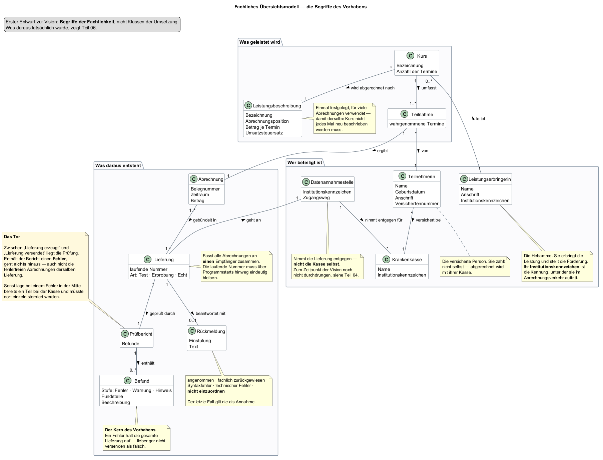

# Teil 01 — Vision


## Ausgangslage

Eine freiberuflich tätige Hebamme gibt Kurse — Geburtsvorbereitung,
Rückbildung, Beratung in Gruppen. Die Teilnehmerinnen sind gesetzlich
krankenversichert, und deshalb zahlen sie diese Kurse in der Regel nicht selbst:
**abgerechnet wird mit ihrer Krankenkasse.**

Das ist kein Rechnungsschreiben. Die Krankenkassen nehmen für diesen Zweck keine
Briefe und keine PDF-Dateien entgegen, sondern eine strukturierte Datenlieferung
in einem festgelegten Format. Wer abrechnen will, muss eine Datei erzeugen, die
bis auf das einzelne Zeichen einer Vorgabe entspricht.

Für eine einzelne Hebamme gibt es dafür heute zwei Wege:

**Über eine Abrechnungsstelle.** Ein Dienstleister übernimmt Erstellung,
Übermittlung und das Nachhalten der Zahlungen. Er nimmt dafür einen Anteil des
abgerechneten Betrags — üblich sind wenige Prozent.

**Selbst.** Dafür braucht es ein Programm, das die Datei erzeugt, und die
Bereitschaft, sich mit dem Verfahren zu befassen.

Die Daten, aus denen eine solche Abrechnung besteht, liegen ohnehin vor: wer war
in welchem Kurs, an wie vielen Terminen, bei welcher Kasse versichert. **Sie
liegen nur in Listen und Köpfen statt in einer Datei.**

## Ziel dieses Teils

Festlegen, was das Programm können soll — und ebenso wichtig, was nicht.
Dazu ein erstes Bild der Fachlichkeit: welche Begriffe es gibt, wie sie
zusammenhängen und was von ihnen dauerhaft festgehalten werden muss.

## Überlegungen

### Was der eigentliche Wert wäre

Der naheliegende Gedanke ist: ein Programm, das eine Datei erzeugt. Das ist
richtig und zu kurz gedacht.

Denn eine Datei zu erzeugen ist der leichte Teil. Der schwere ist, dass sie
**stimmt**. Eine Abrechnung, die formal fehlerfrei aussieht und einen falschen
Schlüsselwert enthält, wird angenommen, verarbeitet und zurückgewiesen — oft
Wochen später, und dann muss der ganze Vorgang wiederholt werden. Fehler in
diesem Verfahren sind selten laut. Sie sind still und teuer.

> **Der Leitgedanke des Projekts: nicht das Abrechnen ist schwer, sondern das
> Richtigsein.**

Daraus folgt eine Festlegung, die den ganzen Aufbau prägt: **das Programm prüft,
bevor etwas das Haus verlässt.** Nicht als Zusatzfunktion, sondern als Tor, an
dem jede Lieferung vorbeimuss.

### Wer es bedient

Eine einzelne Person, an einem einzelnen Rechner, ohne besondere
Computerkenntnisse und ohne jemanden, der bei Problemen hilft. Meist abends,
nach den Kursen, und dann soll es schnell gehen.

Daraus folgen mehrere Dinge, die später als selbstverständlich erscheinen und es
nicht sind:

- Es darf **nichts zusätzlich installiert** werden müssen — keine Datenbank,
  keine Laufzeitumgebung, kein Serverdienst.
- Die Daten liegen **auf dem Rechner der Anwenderin**, nicht im Netz. Es geht um
  Gesundheitsdaten von Schwangeren.
- Eine Fehlermeldung muss sagen, **was zu tun ist** — nicht, was schiefging.
  „Feld 4 ungültig" hilft niemandem.

### Was es ausdrücklich nicht wird

Diese Liste ist so wichtig wie die andere, weil ein Projekt ohne Grenzen nie
fertig wird.

| Nicht | Warum |
|---|---|
| Kursverwaltung, Terminplanung, Erinnerungen | ein eigenes Feld, und dafür gibt es Werkzeuge |
| Buchhaltung, Steuer, Einnahmenüberschussrechnung | ebenso, und mit eigenen Vorschriften |
| Privatabrechnung mit Selbstzahlern | ein anderes Verfahren mit anderen Regeln |
| Mehrbenutzerbetrieb, Praxisverwaltung | eine bewusste Grenze; die gewählte Datenhaltung lässt genau einen Schreiber zu |
| Fachliche Beratung, welche Leistung abrechenbar ist | das entscheidet der Vertrag, nicht ein Programm |

## Entscheidung

**Das Projekt wird ein Einzelplatzprogramm, das aus vorhandenen Kursdaten eine
prüffähige Abrechnungsdatei erzeugt — und das jede Datei prüft, bevor sie
hinausgeht.**

Fünf Kernfähigkeiten:

1. **Stammdaten führen** — Teilnehmerinnen mit Versicherungsangaben, die
   Leistungserbringerin selbst, Gruppen als Zusammenfassung eines Kurses.
2. **Leistungen beschreiben** — was ein Kurs kostet, unter welcher Position er
   abgerechnet wird. Einmal festgelegt, mehrfach verwendet.
3. **Abrechnung erzeugen** — aus Gruppe, Leistungsbeschreibung und Terminanzahl
   entsteht die Nachricht im vorgeschriebenen Format.
4. **Prüfen** — Aufbau, Zähler, Summen, Pflichtangaben. Ein Fehler hält den
   gesamten Lauf auf.
5. **Zustellen und Rückmeldungen einordnen** — die Datei an den richtigen
   Empfänger, und die Antwort verständlich machen.

### Warum nicht der einfachere Weg

Man könnte auf Punkt 4 verzichten und darauf setzen, dass die Empfängerseite
schon meckern wird. Das wäre erheblich weniger Arbeit.

Dagegen spricht: **eine Beanstandung von außen kommt spät und kostet einen
vollständigen Wiederholungsdurchlauf.** Eine Beanstandung im eigenen Programm
kostet dreißig Sekunden. Der Unterschied ist der ganze Sinn des Vorhabens —
ohne die Prüfung wäre das Programm ein Dateischreiber, und dafür lohnt der
Aufwand nicht.

## Ergebnis

Ein Zielbild, an dem sich alle weiteren Teile messen lassen:

```
Kursdaten          →  prüffähige Abrechnungsdatei  →  Krankenkasse
(liegen vor)          (das Programm erzeugt sie)      (zahlt oder beanstandet)
                              │
                        geprüft, bevor
                       sie das Haus verlässt
```

### Die Begriffe und ihre Beziehungen

Bevor entschieden werden kann, wie etwas gebaut wird, muss feststehen, **wovon
überhaupt die Rede ist**. Das folgende Übersichtsmodell hält die Begriffe der
Fachlichkeit fest und wie sie zusammenhängen — noch nicht als Klassen eines
Programms, sondern als Landkarte des Gegenstands.



Drei Beobachtungen aus diesem Bild prägen alles Weitere:

**Die Teilnehmerin ist nicht die Zahlende.** Zwischen der erbrachten Leistung
und dem Geld steht die Krankenkasse. Damit hängt an jeder Teilnehmerin ein
zweiter Satz Angaben — Versichertennummer, Status, Kasse —, der mit dem Kurs
nichts zu tun hat und ohne den trotzdem nichts geht.

**Die Lieferung ist eine eigene Sache, nicht nur ein Versandvorgang.** Sie
bündelt mehrere Abrechnungen an *einen* Empfänger und trägt eine laufende
Nummer, die sich nie wiederholen darf. Etwas, das eine Nummer führt und einen
Zustand hat, ist ein Gegenstand des Modells und keine Handlung.

**Zwischen Erzeugen und Versenden steht ein Tor.** Der Prüfbericht ist kein
Nebenprodukt, sondern die Bedingung dafür, dass die Lieferung das Haus
verlässt. Er hängt deshalb an der Lieferung und nicht neben ihr.

Auffällig ist außerdem, dass die Lieferung **nicht an die Krankenkasse** geht,
sondern an eine Datenannahmestelle. Wie sich diese Unterscheidung auswirkt, war
zu diesem Zeitpunkt noch nicht absehbar — sie wird in Teil 04 zum Problem.

### Was dauerhaft festgehalten werden muss

Aus denselben Begriffen ergibt sich ein erster Entwurf der Datenhaltung. Er ist
bewusst noch fachlich gehalten: die Schlüssel sind Gedanken, keine Spalten.


Die Aufteilung in drei Bereiche ist die eigentliche Aussage des Bildes.
**Stammdaten** werden gepflegt und ändern sich selten. **Bewegungsdaten**
entstehen im Betrieb und wachsen mit jedem Lauf. **Betriebsdaten** werden
einmal eingerichtet und dann kaum noch angefasst — gehören aber trotzdem in die
Ablage und nicht in eine Datei daneben.

Zwei Festlegungen fallen hier bereits, und beide haben einen Grund, der später
gebraucht wird:

| Festlegung | Warum sie so getroffen wird |
|---|---|
| Eine Abrechnung gehört zu genau einer Lieferung | Trifft eine Zurückweisung ein, muss beantwortbar sein, was eigentlich wohin gegangen ist. Ohne diesen Bezug ist die Antwort nicht rekonstruierbar. |
| Ein Befund hängt an der Lieferung, nicht an der Abrechnung | Manche Beanstandungen betreffen die Lieferung als Ganzes — Zähler, Summen, Rahmen. Sie hätten an keiner einzelnen Abrechnung einen Platz. |

Ebenso bewusst ist, dass der **Zähler** für die laufende Nummer eine eigene
Ablage bekommt statt eines Werts im Arbeitsspeicher. Eine Nummer, die nach
einem Neustart wieder von vorn zählt, erzeugt eine doppelte
Datenaustauschreferenz — und die ist ein Zurückweisungsgrund, der sich nicht
mehr aus der Datei heraus reparieren lässt.

Die **Einstellungen** stehen als Schlüssel-Wert-Vorrat da und nicht als Tabelle
mit festen Spalten. Eine neue Einstellung soll keine Änderung am Datenmodell
verlangen.

**Woran sich Erfolg messen lässt**, in dieser Reihenfolge:

| Maßstab | Warum dieser |
|---|---|
| Eine erzeugte Datei wird ohne Beanstandung angenommen | der eigentliche Zweck |
| Ein Fehler in den Daten fällt vor dem Versand auf | der eigentliche Wert |
| Der Weg von den Kursdaten zur Datei dauert Minuten | sonst benutzt es niemand |
| Die Anwenderin versteht, was das Programm ihr sagt | sonst ruft sie doch wieder an |

## Offen geblieben

- **Wie das Format genau aussieht** und welche Vorgaben verbindlich sind — das
  ist Gegenstand von Teil 02.
- **Was von der Vision überhaupt erreichbar ist.** Der Versand an eine
  Krankenkasse ist kein technisches Problem allein; es gibt Zulassungen und
  Nachweise, die niemand programmieren kann. Teil 04 grenzt das ab.
- **Ob sich der eigene Weg wirtschaftlich lohnt** gegenüber einer
  Abrechnungsstelle. Diese Frage stellt sich am Ende noch einmal, mit Zahlen —
  siehe Teil 23.
- **Wie aus den Begriffen Klassen werden** und aus dem Datenmodell ein Schema.
  Beides ist hier absichtlich noch fachlich gehalten; die Umsetzung folgt in den
  Teilen 06 und 07. Dass die beiden Bilder dort nicht mehr gleich aussehen
  werden, ist zu erwarten — **wo sie abweichen, ist die interessante Stelle.**

