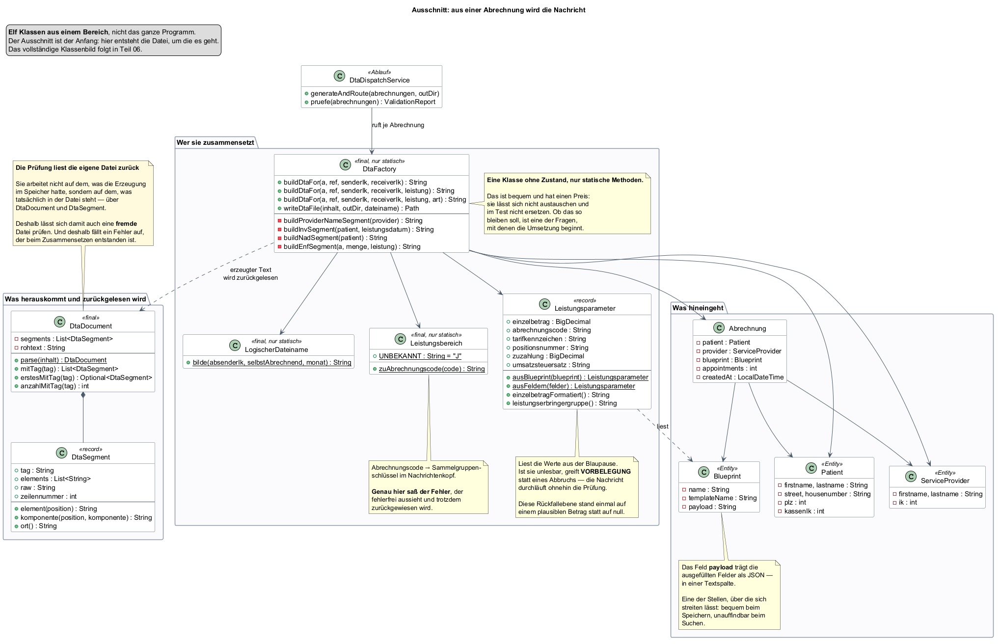
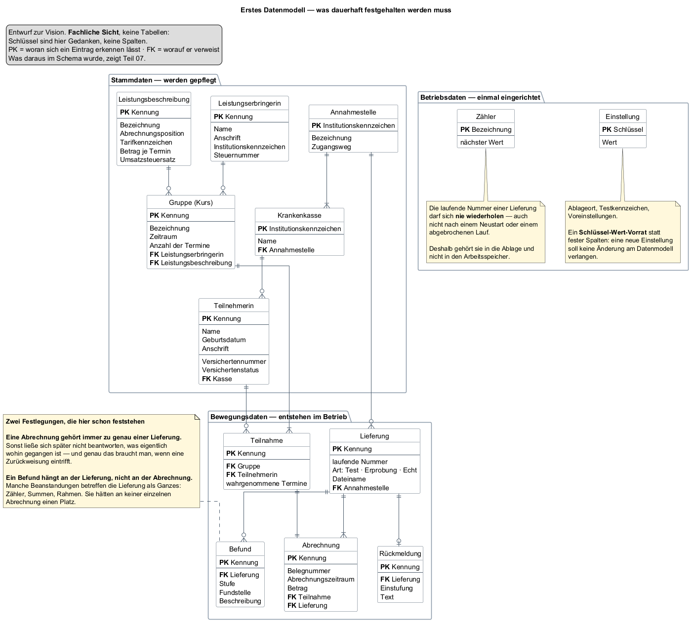

## Ausgangslage

Wer als Freiberuflerin Leistungen für gesetzlich Versicherte erbringt, rechnet
sie nicht mit den Versicherten ab, sondern **mit deren Krankenkasse**. Das gilt
für Hebammenhilfe ebenso wie für Heilmittel oder Rehabilitationssport — die
Leistungen unterscheiden sich, das Verfahren dahinter kaum.

Der konkrete Anlass dieses Projekts sind Kurse einer freiberuflich tätigen
Hebamme: Geburtsvorbereitung, Rückbildung, Beratung in Gruppen. Er ist der erste
Fall, nicht der einzige denkbare.

Abgerechnet wird nicht mit einer Rechnung. Die Kassen nehmen dafür weder Briefe
noch PDF-Dateien entgegen, sondern eine strukturierte Datenlieferung in einem
festgelegten Format — **bis auf das einzelne Zeichen vorgegeben.**

Für eine einzelne Leistungserbringerin gibt es dafür zwei Wege:

| Weg | Was er bedeutet | Was er kostet |
|---|---|---|
| **Über eine Abrechnungsstelle** | Ein Dienstleister übernimmt Erstellung, Übermittlung und das Nachhalten der Zahlungen | einen Anteil des abgerechneten Betrags, üblich sind wenige Prozent |
| **Selbst** | Ein eigenes Programm erzeugt die Datei | die Einarbeitung in das Verfahren |

Die Daten, aus denen eine Abrechnung besteht, liegen ohnehin vor: wer hat wann
welche Leistung erhalten, in welchem Umfang, bei welcher Kasse versichert.
**Sie liegen nur in Listen und Köpfen statt in einer Datei.**

## Vision — was das Programm am Ende können soll

Ein Satz vorweg, an dem sich alles Weitere messen lassen muss:

> **Eine einzelne Leistungserbringerin rechnet ihre Leistungen selbst mit den
> gesetzlichen Kassen ab — ohne Abrechnungsstelle, ohne Fachwissen über das
> Datenformat und ohne die Sorge, dass eine fehlerhafte Datei erst Wochen
> später auffällt.**

Ausformuliert heißt das: am Ende kann das Programm dies.

| # | Am Ende kann das Programm … | Woran man merkt, dass es stimmt |
|---|---|---|
| 1 | **Stammdaten führen** — versicherte Personen, die Leistungserbringerin, Leistungsfälle und was sie kosten | Ein neuer Kurs ist in wenigen Minuten erfasst, ohne Handbuch |
| 2 | **Aus einem Zeitraum eine Lieferung erzeugen** — je Empfänger eine, im vorgeschriebenen Format | Aus „März, diese drei Kurse" wird eine fertige Datei |
| 3 | **Vor dem Versand prüfen** und in verständlicher Sprache sagen, was fehlt | Der Bericht nennt die Stelle und was zu tun ist, nicht nur den Feldnamen |
| 4 | **Die Lieferung zustellen** — auf dem vorgeschriebenen Weg, an die zuständige Datenannahmestelle, verschlüsselt und signiert | Die Kasse nimmt sie an, ohne dass jemand nachfassen muss |
| 5 | **Die Antwort einordnen** — angenommen, fachlich zurückgewiesen, Syntaxfehler, technischer Fehler | Die Anwenderin weiß nach dem Lesen, ob sie korrigieren, neu erzeugen oder nur erneut senden muss |
| 6 | **Eine Zurückweisung nachbearbeiten**, ohne alles neu zu erfassen | Die korrigierte Abrechnung geht als neue Lieferung hinaus, mit sauberer Nummer |
| 7 | **Einen weiteren Leistungsbereich aufnehmen** — über Einträge, nicht über Umbau | Rehabilitationssport neben Hebammenhilfe, ohne dass eine Klasse sich ändert |

Und das alles **auf einem einzelnen Rechner, ohne Installation und ohne dass
Gesundheitsdaten das Haus verlassen.**

Nicht jeder dieser Punkte ist am Ende dieses Teils entschieden, und nicht jeder
ist allein durch Programmieren erreichbar — Punkt 4 hängt an Zulassungen, die
niemand schreiben kann. Das ist Gegenstand von Teil 04.

## Ziel dieses Teils

- Festlegen, was das Programm können soll — und ebenso wichtig, was nicht.
- Entscheiden, wie weit es tragen soll: ein Programm für einen Kursanbieter oder
  eines für die Abrechnung mit gesetzlichen Kassen überhaupt.
- Ein erstes Bild der Fachlichkeit: welche Begriffe es gibt, wie sie
  zusammenhängen, was von ihnen dauerhaft festgehalten werden muss.

## Überlegungen

### Was der eigentliche Wert wäre

Der naheliegende Gedanke — ein Programm, das eine Datei erzeugt — ist richtig
und zu kurz gedacht. Eine Datei zu erzeugen ist der leichte Teil. Der schwere
ist, dass sie **stimmt**.

Eine Abrechnung, die formal fehlerfrei aussieht und einen falschen Schlüsselwert
enthält, wird angenommen, verarbeitet und zurückgewiesen — oft Wochen später.
**Fehler in diesem Verfahren sind selten laut. Sie sind still und teuer.**

> **Der Leitgedanke des Projekts: nicht das Abrechnen ist schwer, sondern das
> Richtigsein.**

Daraus folgt die Festlegung, die den ganzen Aufbau prägt: **das Programm prüft,
bevor etwas das Haus verlässt** — nicht als Zusatzfunktion, sondern als Tor, an
dem jede Lieferung vorbeimuss.

### Wie weit soll es tragen

Man könnte das Programm auf Hebammenkurse zuschneiden. Das wäre die kleinere
Aufgabe und für den ersten Fall vollkommen ausreichend.

Dagegen spricht ein Blick auf das Verfahren selbst: **fast alles daran ist nicht
leistungsspezifisch.**

| Bleibt über die Leistungsbereiche gleich | Wechselt je Leistungsbereich |
|---|---|
| Der Aufbau der Nachricht — Rahmen, Rechnungs-, Versicherten-, Leistungs- und Summenteile | Der Sammelgruppenschlüssel im Nachrichtenkopf |
| Die Beteiligten und ihre Institutionskennzeichen samt Prüfziffer | Der Abrechnungscode |
| Prüfung, Zählerführung, Summenbildung | Positionsnummern und Tarifkennzeichen |
| Lieferung, Zustellweg, Einordnung der Rückmeldung | Der Vertrag, aus dem sich die zulässigen Werte ergeben |

Die rechte Spalte ist kurz, und sie besteht ausschließlich aus **Werten**, nicht
aus Abläufen. Ein zweiter Leistungsbereich verlangt also Einträge, keinen Umbau
— vorausgesetzt, das Modell trennt beides von Anfang an.

Genau das kostet in der Vision fast nichts und später sehr viel: ein Begriff,
der von Beginn an „Leistungsfall" heißt statt „Kurs", trägt eine
Behandlungsserie mit, ohne dass jemand ihn umbenennen muss.

### Wer es bedient

Eine einzelne Person, an einem einzelnen Rechner, ohne besondere
Computerkenntnisse und ohne jemanden, der bei Problemen hilft. Meist abends,
nach der Arbeit.

| Umstand | Was daraus für das Programm folgt |
|---|---|
| Niemand richtet etwas ein | Es darf **nichts zusätzlich installiert** werden müssen — keine Datenbank, keine Laufzeitumgebung, kein Serverdienst |
| Es geht um Gesundheitsdaten | Die Daten bleiben **auf dem Rechner der Anwenderin**, nicht im Netz |
| Niemand hilft, wenn etwas klemmt | Eine Meldung sagt, **was zu tun ist** — nicht, was schiefging. „Feld 4 ungültig" hilft niemandem |
| Abends, nebenher | Der Weg von den erfassten Daten zur fertigen Datei muss kurz sein |

### Was es ausdrücklich nicht wird

So wichtig wie die andere Liste — ein Projekt ohne Grenzen wird nie fertig.

| Nicht | Warum |
|---|---|
| Kurs- und Terminverwaltung, Erinnerungen | ein eigenes Feld, und dafür gibt es Werkzeuge |
| Buchhaltung, Steuer, Einnahmenüberschussrechnung | ebenso, und mit eigenen Vorschriften |
| Privatabrechnung mit Selbstzahlern | ein anderes Verfahren mit anderen Regeln |
| Mehrbenutzerbetrieb, Praxisverwaltung | eine bewusste Grenze; die gewählte Datenhaltung lässt genau einen Schreiber zu |
| Ein mitgelieferter Katalog gültiger Positionsnummern je Bereich | die ergeben sich aus dem Vertrag. Das Programm hält den Rahmen bereit, die Werte trägt ein, wer den Vertrag hat |
| Fachliche Beratung, welche Leistung abrechenbar ist | das entscheidet ebenfalls der Vertrag, nicht ein Programm |

## Entscheidung

**Das Projekt wird ein Einzelplatzprogramm, das aus vorhandenen Leistungsdaten
eine prüffähige Abrechnungsdatei erzeugt — und das jede Datei prüft, bevor sie
hinausgeht.** Der Aufbau folgt dem Verfahren, nicht einem einzelnen
Leistungsbereich; der erste bediente ist die Hebammenhilfe.

Von den sieben Punkten der Vision werden damit **die ersten fünf zum Bauauftrag**
— gegliedert in fünf Kernfähigkeiten. Die Punkte 6 und 7, Nachbearbeitung einer
Zurückweisung und ein weiterer Leistungsbereich, bleiben Ziel, aber nicht
Gegenstand des ersten Durchgangs.

| # | Kernfähigkeit | Was dahintersteckt |
|---|---|---|
| 1 | **Stammdaten führen** | versicherte Personen mit ihren Versicherungsangaben, die Leistungserbringerin selbst, Leistungsfälle als Zusammenfassung — ein Kurs, eine Behandlungsserie |
| 2 | **Leistungen beschreiben** | was eine Einheit kostet, unter welcher Position sie abgerechnet wird — einmal festgelegt, mehrfach verwendet. Hier sitzt das Bereichsspezifische |
| 3 | **Abrechnung erzeugen** | aus Leistungsfall, Beschreibung und Anzahl der Einheiten entsteht die Nachricht im vorgeschriebenen Format |
| 4 | **Prüfen** | Aufbau, Zähler, Summen, Pflichtangaben — ein Fehler hält den gesamten Lauf auf |
| 5 | **Zustellen und einordnen** | die Datei an den richtigen Empfänger, und die Antwort verständlich machen |

### Warum nicht der einfachere Weg

Man könnte auf Nummer 4 verzichten und darauf setzen, dass die Empfängerseite
schon meckern wird — das wäre erheblich weniger Arbeit. Dagegen steht der Preis
einer Beanstandung:

| Wo der Fehler auffällt | Was er kostet |
|---|---|
| im eigenen Programm, vor dem Versand | dreißig Sekunden |
| bei der Kasse, Wochen später | ein vollständiger Wiederholungsdurchlauf |

Ohne die Prüfung wäre das Programm ein Dateischreiber, und dafür lohnt der
Aufwand nicht.

## Ergebnis

### Das Zielbild

| Station | Was dort geschieht |
|---|---|
| **Leistungsdaten** | liegen ohnehin vor — in Listen und Köpfen |
| **Das Programm** | erzeugt daraus die Abrechnungsdatei **und prüft sie, bevor sie das Haus verlässt** |
| **Die Krankenkasse** | zahlt oder beanstandet |

### Womit begonnen wird

Ein Klassenbild des ganzen Programms wäre an dieser Stelle unbrauchbar: zu
groß, um es zu besprechen, und zu früh, um es zu verantworten. Stattdessen
**ein Ausschnitt von elf Klassen** — der Bereich, in dem aus einer Abrechnung
die Nachricht entsteht. Er ist der Anfang, weil hier die Datei erzeugt wird,
um die es im ganzen Vorhaben geht.

Drei Dinge lassen sich daran schon besprechen, bevor eine Zeile geändert wird:

| Stelle | Worüber zu reden ist |
|---|---|
| `DtaFactory` hat **keinen Zustand**, nur statische Methoden | Bequem beim Aufrufen, aber nicht austauschbar und im Test nicht ersetzbar. Ob das so bleibt, ist eine der ersten Fragen |
| `Leistungsparameter` fällt bei unlesbarer Blaupause auf eine **Vorbelegung** zurück, statt abzubrechen | Vertretbar, weil die Prüfung ohnehin folgt — aber genau diese Rückfallebene stand einmal auf einem plausiblen Betrag statt auf null |
| `Leistungsbereich` bildet den Abrechnungscode auf den **Sammelgruppenschlüssel** ab | Ein einziger Buchstabe im Nachrichtenkopf. Steht dort der falsche, sieht die Datei fehlerfrei aus und wird trotzdem zurückgewiesen |

Bemerkenswert ist die gestrichelte Linie zurück: Die Prüfung arbeitet nicht auf
dem, was die Erzeugung im Speicher hatte, sondern **liest die fertige Datei
wieder ein** — über `DtaDocument` und `DtaSegment`. Deshalb fällt ein Fehler
auf, der erst beim Zusammensetzen entsteht, und deshalb lässt sich mit
demselben Werkzeug auch eine fremde Datei prüfen.

Das vollständige Klassenbild und das fachliche Übersichtsmodell folgen in Teil
06, wenn genug entschieden ist, um sie zu verantworten.

### Was dauerhaft festgehalten werden muss

Anders als der Ausschnitt oben zeigt das zweite Bild **die ganze Breite** — aber
auf fachlicher Ebene, nicht als Schema: **die Schlüssel sind hier Gedanken, keine
Spalten.** Ein Datenmodell verträgt das, ein Klassenbild nicht; deshalb ist das
eine vollständig und das andere ein Ausschnitt.

Auffällig darin ist ein Kasten, der in der Vision noch harmlos aussieht: Die
Lieferung geht **nicht an die Krankenkasse**, sondern an eine Annahmestelle. Wie
sich diese Unterscheidung auswirkt, war zu diesem Zeitpunkt nicht absehbar — sie
wird in Teil 04 zum Thema.

Die Dreiteilung ist die eigentliche Aussage des Bildes:

| Bereich | Kennzeichen |
|---|---|
| **Stammdaten** | werden gepflegt, ändern sich selten |
| **Bewegungsdaten** | entstehen im Betrieb, wachsen mit jedem Lauf |
| **Betriebsdaten** | einmal eingerichtet — gehören trotzdem in die Ablage und nicht in eine Datei daneben |

Vier Festlegungen fallen hier bereits, jede mit einem Grund, der später gebraucht
wird:

| Festlegung | Grund |
|---|---|
| Eine Abrechnung gehört zu **genau einer** Lieferung | Trifft eine Zurückweisung ein, muss beantwortbar sein, was eigentlich wohin gegangen ist |
| Ein Befund hängt an der **Lieferung**, nicht an der Abrechnung | Zähler, Summen und Rahmen betreffen die Lieferung als Ganzes und hätten an keiner einzelnen Abrechnung einen Platz |
| Der Zähler bekommt eine **eigene Ablage** statt eines Werts im Arbeitsspeicher | Eine Nummer, die nach dem Neustart von vorn zählt, erzeugt eine doppelte Datenaustauschreferenz — ein Zurückweisungsgrund, der sich nicht mehr aus der Datei heraus reparieren lässt |
| Einstellungen als **Schlüssel-Wert-Vorrat** statt fester Spalten | Eine neue Einstellung soll keine Änderung am Datenmodell verlangen |

Alles Bereichsspezifische sammelt sich in einer einzigen Entität, der
**Leistungsbeschreibung**. Das ist keine Schönheit, sondern der Preis dafür, dass
ein weiterer Leistungsbereich später ein Eintrag bleibt und kein Umbau wird.

### Woran sich Erfolg messen lässt

In dieser Reihenfolge:

| Maßstab | Warum dieser |
|---|---|
| Eine erzeugte Datei wird ohne Beanstandung angenommen | der eigentliche Zweck |
| Ein Fehler in den Daten fällt vor dem Versand auf | der eigentliche Wert |
| Der Weg von den Leistungsdaten zur Datei dauert Minuten | sonst benutzt es niemand |
| Die Anwenderin versteht, was das Programm ihr sagt | sonst ruft sie doch wieder an |
| Ein weiterer Leistungsbereich kommt ohne Änderung am Aufbau hinzu | die Probe darauf, ob die Verallgemeinerung getragen hat |

## Offen geblieben

- **Wie das Format genau aussieht** und welche Vorgaben verbindlich sind — das
  ist Gegenstand von Teil 02.
- **Welche Leistungsbereiche tatsächlich bedient werden.** Die Vision hält den
  Rahmen offen; welche Werte darin gültig sind, ergibt sich aus Verträgen, die
  nicht vorliegen. Teil 03 grenzt das ein.
- **Was von der Vision überhaupt erreichbar ist.** Der Versand an eine
  Krankenkasse ist kein technisches Problem allein; es gibt Zulassungen und
  Nachweise, die niemand programmieren kann. Teil 04 grenzt das ab.
- **Ob sich der eigene Weg wirtschaftlich lohnt** gegenüber einer
  Abrechnungsstelle. Diese Frage stellt sich am Ende noch einmal, mit Zahlen —
  siehe Teil 23.
- **Wie aus den Begriffen Klassen werden** und aus dem Datenmodell ein Schema.
  Die Umsetzung folgt in den Teilen 06 und 07. Dass die beiden Bilder dort nicht
  mehr gleich aussehen werden, ist zu erwarten — **wo sie abweichen, ist die
  interessante Stelle.**
