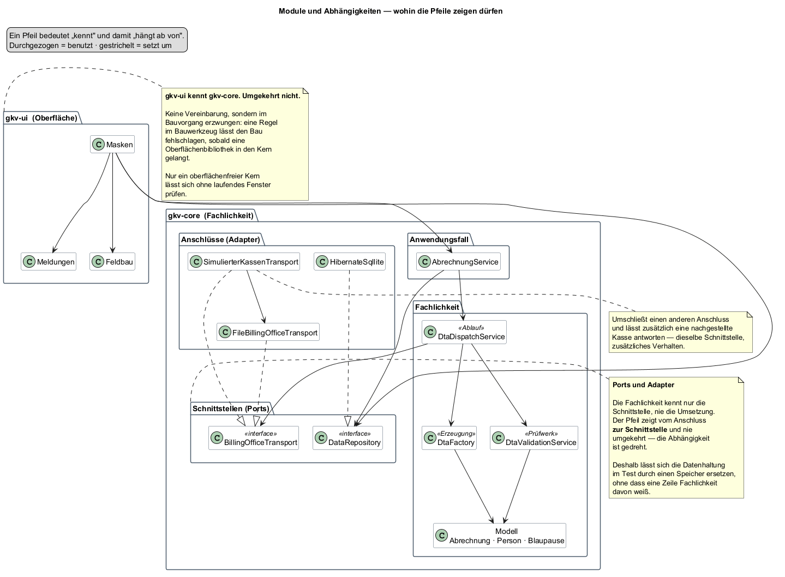

## Ausgangslage

Der Gegenstand ist geklärt, die Anforderungen stehen, die Grenzen sind gezogen.
Jetzt beginnt der Entwurf — und der erste Schnitt ist der folgenreichste.

Eine Anforderung aus Teil 03 gibt dabei den Ausschlag: **Q5 — die Fachlichkeit
muss ohne Oberfläche prüfbar sein.**

## Ziel dieses Teils

Festlegen, aus welchen Teilen das Programm besteht, wer wen kennen darf und
warum. Und einen Weg finden, diese Festlegung **nicht nur zu vereinbaren, sondern
durchzusetzen.**

## Überlegungen

### Warum Q5 keine Geschmacksfrage ist

Ein Programm mit Oberfläche lässt sich auf zwei Arten bauen.

**In einem Stück.** Die Maske holt die Daten, rechnet, erzeugt die Datei und
zeigt das Ergebnis. Das ist der kürzeste Weg von der Idee zum laufenden Programm.

**Getrennt.** Die Fachlichkeit weiß nichts von einer Oberfläche; die Oberfläche
ruft sie auf. Das ist mehr Arbeit — man schreibt Klassen, die man im ersten
Moment nicht braucht.

Für dieses Projekt entscheidet nicht die Eleganz, sondern eine schlichte
Beobachtung: **Was sich nur mit geöffnetem Fenster prüfen lässt, wird selten
geprüft.** Ein Prüflauf, der ein Fenster öffnet, braucht eine Anzeige, ist
langsam und schlägt aus Gründen fehl, die mit der Sache nichts zu tun haben.

Und die Prüfung ist bei diesem Programm nicht Beiwerk, sondern der Zweck. Ein
Aufbau, der sie erschwert, verfehlt das Vorhaben.

### Eine Vereinbarung, die niemand einhält

Die Trennung als Absprache zu führen — „in den Kern kommt nichts von der
Oberfläche" — funktioniert genau so lange, wie jemand daran denkt.

Beim ersten Mal, wenn eine Fachklasse „nur kurz" einen Wert aus einem Eingabefeld
braucht, ist die Grenze weg. Und danach lässt sie sich nicht wiederherstellen,
ohne alles anzufassen.

Deshalb die Frage: **Kann man die Grenze so ziehen, dass ihre Verletzung
auffällt, bevor sie Schaden anrichtet?**

Sie kann. Der Bauvorgang lässt sich anweisen, den Bau abzubrechen, sobald eine
Oberflächenbibliothek im Kern auftaucht. Wer es trotzdem versucht, bekommt keinen
Rat, sondern einen Fehler.

### Wie die Fachlichkeit an ihre Daten kommt

Bleibt ein Widerspruch: Die Fachlichkeit soll nichts von der Umgebung wissen —
aber sie braucht Daten aus einer Datenbank und muss eine Datei irgendwohin geben.

Die Auflösung ist ein Kunstgriff, der einfach klingt und viel entscheidet:

> **Die Fachlichkeit beschreibt, was sie braucht. Sie kennt nicht, wer es
> liefert.**

Sie erklärt eine Schnittstelle — „so komme ich an Patienten" — und arbeitet nur
gegen diese Erklärung. Wer sie tatsächlich erfüllt, entscheidet sich beim Start
des Programms.

Damit dreht sich die Abhängigkeit um: Nicht die Fachlichkeit hängt an der
Datenbank, sondern der Datenbankzugang hängt an der Fachlichkeit. Der Pfeil zeigt
vom Anschluss zur Schnittstelle und nie umgekehrt.

Der Gewinn ist unmittelbar praktisch. Im Prüflauf tritt an die Stelle der
Datenbank ein Speicher im Arbeitsspeicher — **ohne dass eine Zeile Fachlichkeit
davon weiß.**

### Wie viele Schichten

Erwogen wurden drei Zuschnitte:

| Zuschnitt | Wofür er taugt | Warum nicht hier |
|---|---|---|
| Ein Modul, innen nach Zuständigkeit sortiert | schnell, übersichtlich bei kleinem Umfang | Die Grenze bliebe eine Absprache |
| Zwei Module: Fachlichkeit und Oberfläche | erzwingbar, überschaubar | — |
| Viele kleine Module je Zuständigkeit | saubere Grenzen überall | Bei einem Einzelplatzprogramm mehr Verwaltung als Nutzen |

Gewählt wurde der mittlere: **zwei Module**. Die Grenze, die zählt, ist die
zwischen Fachlichkeit und Oberfläche — und genau die lässt sich durchsetzen.

## Entscheidung

**Zwei Module. Die Oberfläche kennt die Fachlichkeit, die Fachlichkeit die
Oberfläche nicht. Diese Richtung wird im Bauvorgang erzwungen, nicht vereinbart.**

Innerhalb der Fachlichkeit gilt eine Schichtung:

| Schicht | Aufgabe | Kennt |
|---|---|---|
| **Anwendungsfall** | einen Vorgang von Anfang bis Ende führen | die Fachlichkeit und die Schnittstellen |
| **Fachlichkeit** | Erzeugung, Prüfung, Ablauf, Modell | nur sich selbst |
| **Schnittstellen** | beschreiben, was gebraucht wird | nichts |
| **Anschlüsse** | die Schnittstellen erfüllen — Datenbank, Versandweg | die Schnittstelle, die sie erfüllen |

### Warum nicht der einfachere Weg

Ein Modul wäre erheblich weniger Aufwand gewesen, und für ein Programm dieser
Größe wäre das vertretbar.

Dagegen spricht das eine Argument, das hier alles schlägt: **Ohne die erzwungene
Grenze wäre die Fachlichkeit nicht ohne Fenster prüfbar** — und damit wäre die
Prüfung, also der Zweck des Programms, selbst ungeprüft geblieben.

Die Mehrarbeit ist der Preis dafür, dass diese Aussage nachprüfbar bleibt und
nicht nur behauptet wird.

## Ergebnis

Ein Aufbau, in dem sich jede Frage „darf das hier stehen?" beantworten lässt,
ohne zu diskutieren:

| Vorhaben | Wohin |
|---|---|
| Eine neue Prüfregel | in die Fachlichkeit, zu den Regeln |
| Ein neuer Versandweg | ein neuer Anschluss an die vorhandene Schnittstelle |
| Ein neues Feld an einer Person | ins Modell |
| Eine neue Maske | in die Oberfläche |
| Fachlogik, die man gerade in einer Maske braucht | **nicht in die Maske** — in den zuständigen Dienst |

Die letzte Zeile ist die, die im Alltag wehtut, und sie ist der Grund für die
Grenze.

Verwendete architektonische Mittel bis hierhin:

| Mittel | Wozu |
|---|---|
| Schichtung | Zuständigkeiten trennen |
| Schnittstelle und Anschluss | die Abhängigkeit umdrehen |
| Modulgrenze im Bauvorgang erzwungen | die Trennung überlebt den Alltag |

## Offen geblieben

- **Wie der Datenbankzugang aussieht**, der die Schnittstelle erfüllt. Teil 09.
- **Wie ein Anwendungsfall aufgebaut ist**, der mehrere Dienste führt. Teil 15.
- **Ob zwei Module reichen.** Solange die Oberfläche schlank bleibt, ja. Die
  Frage kommt in Teil 23 zurück.
