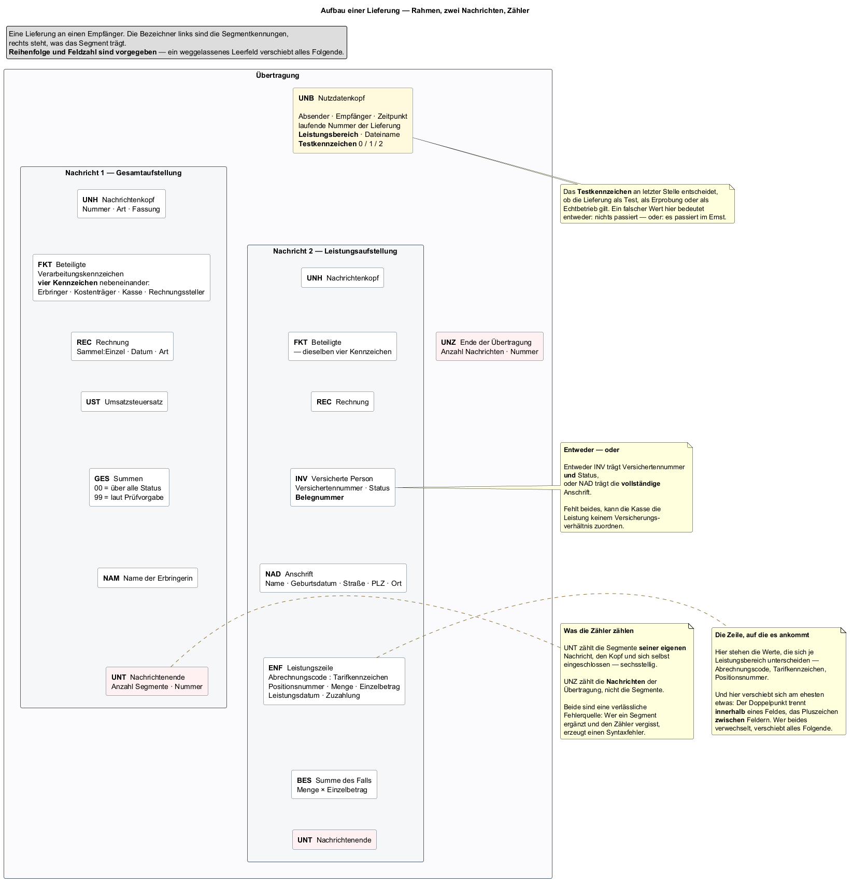

## Ausgangslage

Das Domänenmodell steht (Teil 10): Personen, Gruppen, Blaupausen, Abrechnungen.
Offen blieb dort ausdrücklich **die fehlende Lieferung** — die Abrechnung
hinterlässt eine Spur in der Datenbank, aber noch keine Datei, die eine Kasse
entgegennehmen könnte.

Diese Datei ist kein eigener Entwurf dieses Projekts. Ihr Aufbau steht in der
Anlage 3 zu den Richtlinien nach § 302 SGB V und ist zwischen den
Leistungserbringern und den Kassen vereinbart, nicht frei wählbar. Was hier zu
entscheiden ist, ist nicht *wie die Nachricht aussieht*, sondern *wie das
Programm weiß, wie sie aussieht.*

## Ziel dieses Teils

Den Aufbau einer Lieferung — Segmente, Felder, Schachtelung, Zähler — so
festhalten, dass ihn das Programm lesen kann, nicht nur ein Mensch. Dazu das
Diagramm, das diese Schachtelung zeigt.

## Überlegungen

### Vorgegebene Form, freie Darstellung

Die einzige Entscheidung, die dieses Projekt zum Format selbst trifft, ist
keine: Reihenfolge, Feldzahl und Pflichtangaben sind vorgegeben. Die
Gestaltungsfreiheit liegt ausschließlich in der **Darstellung im Programm** —
und dort stellt sich dieselbe Frage wie in Teil 09 bei der Datenbank: Code oder
Daten?

| Möglichkeit | Folge |
|---|---|
| Jedes Segment als eigene Java-Klasse mit benannten Feldern | Lesbar, aber jede Ergänzung — ein weiterer Leistungsbereich, eine neue Fassung der Anlage 3 — verlangt eine neue Übersetzung |
| Segmente und Felder generisch beschreiben, aus Daten geladen | Eine Ergänzung ist eine neue oder geänderte Datei, kein neuer Code |

Gewählt wurde die zweite. Dreizehn Segmenttypen mit insgesamt weit über
vierzig Feldern liegen als JSON unter `gkv-core/src/main/resources/segments/` —
eine Datei je Segmenttyp, jede mit Position, Typ, Länge, Pflichtstatus,
Beispiel und einer Beschreibung je Feld. Dieselbe Beschreibung bedient drei
Abnehmer: die Erzeugung der Nachricht (Teil 12), ihre Prüfung (Teil 14) und die
Erklärtexte unter den Eingabefeldern der Oberfläche. **Eine Quelle für drei
Abnehmer verhindert, dass sie sich widersprechen** — dieselbe Begründung wie
für die Einstellungstabelle in Teil 09.

### Wie viel Typisierung in den Code gehört

Die JSON-Beschreibung unterscheidet fein: `STRING`, `INTEGER`, `DECIMAL`,
`COMPOSITE`, dazu Länge, Format und ein Prüfmuster. Im Code kommt davon nur
ein grobes Dreier-Enum an — `FieldType.DATE`, `NUMBER`, `STRING`.

Das ist kein Versehen, sondern zwei Ebenen mit unterschiedlichem Bedarf. Die
feine Unterscheidung braucht, wer das Feld liest oder prüft — etwa, ob ein
Betrag zwei Nachkommastellen mit Komma trägt. Das entscheidet ein Prüfwerk oder
ein Mensch, der die Beschreibung liest, nicht die Objektstruktur, die ein Feld
im Speicher hält. Für die hängt nur ab, ob sie als Datum, als Zahl oder als
Text behandelt wird.

### Warum das Kompositfeld keinen eigenen Zweig braucht

Innerhalb eines Datenelements trennt der Doppelpunkt Komponenten — etwa
`Abrechnungscode:Tarifkennzeichen` im `ENF`. Die naheliegende Abbildung wäre ein
Baum: ein Feld, das Unterfelder enthält.

Gebaut wurde stattdessen eine flache, geordnete Liste mit einem kombinierten
Schlüssel: die Position des Feldes, mit einem Faktor multipliziert, plus die
Position der Komponente. `Abrechnungscode` und `Tarifkennzeichen` landen so als
zwei benachbarte Einträge unter Schlüsseln wie `200` und `201`, nicht als
Unterbaum von `2`. **Eine Ordnung reicht, wenn danach nur die Reihenfolge
zählt** — ein zweiter Baum hätte nichts zusätzlich ausgedrückt.

### Was die Beschreibung nicht trägt

Die JSON-Dateien legen die *Form* eines Feldes fest: Position, Typ, Länge,
Pflichtstatus. Sie legen **nicht** fest, was zwischen Feldern gilt — etwa, dass
entweder `INV` den Versichertenstatus trägt oder `NAD` die vollständige
Anschrift, oder dass im `ENF` der Doppelpunkt ausschließlich innerhalb des
einen Kompositfelds vorkommt und kein Feld verschoben werden darf. Solche
Regeln stehen bislang nur als Fließtext in `note` und `validationRule` — lesbar
für Menschen, wirkungslos für das Programm.

Das ist eine bewusste Grenze und keine Lücke, die hier zu schließen wäre: Die
*Form* eines Feldes ist Daten, weil sie sich aufzählen lässt. Eine Regel wie
„entweder — oder" ist Verhalten, und Verhalten als Daten nachzubilden hieße,
in JSON eine zweite Programmiersprache zu erfinden. Wo diese Regeln tatsächlich
geprüft werden, ist Gegenstand von Teil 14.

### Eine Sackgasse mit echten Folgen: der Leistungsbereich

Das sechste Element des `UNB` trägt den **Leistungsbereich** — einen einzelnen
Buchstaben nach Anlage 3, Abschnitt 8.1.14, der sich aus dem Abrechnungscode
der Leistungszeile ergibt. Lange stand dort fest ein `H`.

`H` ist der Sammelgruppenschlüssel für *Leistungserbringer von
Rehabilitationssport* — für eine Hebamme falsch; richtig wäre `F`. Der Wert
stammte aus der Referenzdatei `Valide.DTA`, die im selben Zug den
Abrechnungscode `61` führt. Und `61` gehört tatsächlich zu `H` — die
Referenzdatei war in sich stimmig, nur bildete sie nicht den Fall ab, an dem
der Fehler sich zeigte.

**Eine Referenzdatei, die fehlerfrei durchläuft, beweist Konsistenz — nicht,
dass sie den richtigen Fall abbildet.** Aufgefallen wäre der Fehler erst bei
der Kasse, in der Prüfstufe, die Schlüsselausprägungen gegen das
Schlüsselverzeichnis hält: Die Lieferung wäre angenommen und zurückgewiesen
worden, nicht bezahlt.

Die Lösung ist im Kleinen dieselbe wie die Entscheidung im Großen für dieses
Projektteil: keine Verzweigung im Code, sondern eine Tabelle — Abrechnungscode
auf Buchstabe, vollständig nach Anlage 3 und mit einem eigenen Wert für „dazu
findet sich nichts", statt eines erfundenen Buchstabens, der zufällig zu einem
fremden Bereich gehört.

### Was die Zähler zählen

`UNT` zählt die Segmente der **eigenen** Nachricht, Kopf und Abschluss
eingeschlossen, sechsstellig. `UNZ` zählt die **Nachrichten** der Übertragung,
nicht ihre Segmente. Beide verschieben sich bei jeder Änderung an der
Nachricht mit — ein ergänztes Segment ohne angepassten Zähler ist ein
Syntaxfehler, und zwar einer, der die ganze Lieferung betrifft, nicht nur die
eine Zeile.

## Entscheidung

**Der Nachrichtenaufbau liegt als Daten vor, nicht als Code je Segment.**
Dreizehn JSON-Dateien, eine je Segmenttyp, gelesen über einen gemeinsamen
Parser in zwei Klassen: `SegmentDefinition` für ein Segment, `FieldDefinition`
für ein Feld. Komposita liegen in derselben flachen, geordneten Struktur wie
einfache Felder. Die Typisierung im Code bleibt grob; die feine Form bleibt
Beschreibung.

| Festlegung | Grund |
|---|---|
| Segmentaufbau als JSON, nicht als Java-Klasse je Segment | Eine Ergänzung ist eine Datei, kein neuer Code |
| Eine Quelle für Erzeugung, Prüfung und Oberflächentext | Verhindert widersprüchliche Abschriften derselben Regel |
| Komposita ohne eigenen Baum, über einen kombinierten Positionsschlüssel | Eine Ordnung reicht, wenn nur die Reihenfolge zählt |
| Feldübergreifende Regeln bleiben Text, nicht Struktur | Verhalten gehört in Code, nicht in eine zweite Sprache aus JSON |

### Warum nicht der einfachere Weg

Eine Java-Klasse je Segment wäre im eigenen Code bequemer zu lesen gewesen —
kein Nachschlagen in einer Map, sondern ein benanntes Feld. Dagegen spricht,
dass die Form nicht von diesem Projekt stammt, sondern von einer Anlage, die
sich je Leistungsbereich und Fassung unterscheidet. Jede Klasse hätte bei jeder
Ergänzung eine neue Übersetzung verlangt — genau das Risiko, das die
Leistungsbereich-Tabelle im Kleinen schon zeigt.

## Ergebnis

Der Aufbau einer Lieferung liegt jetzt doppelt vor: maschinenlesbar in den
JSON-Beschreibungen unter `resources/segments/`, und als Bild im
Aufbaudiagramm.

Eine Übertragung beginnt mit `UNB` und endet mit `UNZ`, dazwischen zwei
Nachrichten mit eigenem `UNH`/`UNT`-Paar: **SLGA** trägt die Summen- und
Begleitdaten, **SLLA** die Fall- und Leistungsdaten. Beide tragen dieselben
vier Kennzeichen aus dem `FKT` — Erbringer, Kostenträger, Kasse,
Rechnungssteller — und müssen sich darin mit der jeweils anderen Nachricht
decken.

## Offen geblieben

- **Wovon das Tarifkennzeichen im `ENF` abhängt** — vom Dienstleister, von der
  Kasse, oder ist es wirklich fest. Die Antwort entscheidet, ob es in die
  Segmentbeschreibung, an `ServiceProvider` oder in eine eigene Zuordnung
  gehört. Für einen einzigen Dienstleister mit einem Vertrag liefert die
  heutige Lösung richtige Ergebnisse; mehr wurde noch nicht gebraucht.
- **Die feldübergreifenden Pflichtkonventionen** — INV-oder-NAD, keine
  Feldverschiebung — stehen nur als Text in der Beschreibung, nicht als
  geprüfte Regel. Das wird erst in Teil 14 geschlossen.
